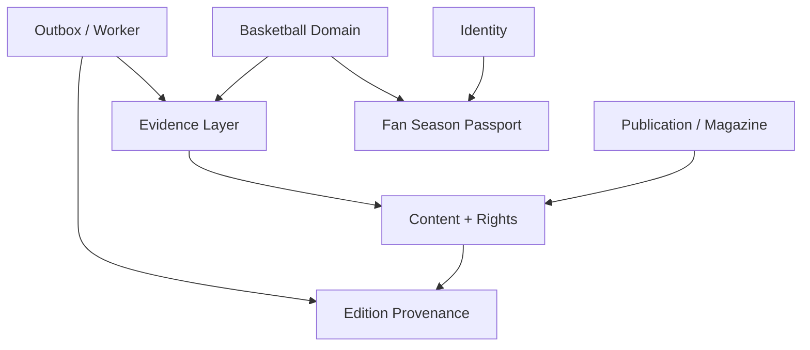

# Courtside TW Product / Architecture Alignment

**Status**: Alignment receipt draft v0.3  
**As of**: 2026-08-07  
**Repository**: `bynanci/courtside-tw`  
**Baseline**: `main` after canonical T005 implementation and T005 completion receipt

## Repository assessment

### Current state

- `main` 保留 Nuxt SSR/BFF → Spring Boot modular monolith → PostgreSQL／Transactional Outbox → S3-compatible storage／CDN 的核准 topology。
- `DESIGN.md` 已建立 Arena Night、Editorial Paper、Swiss Editorial Grid、Courtside Data、Procedural Signal、system-adaptive light/dark 與 mobile-first direction。
- ADR-0001～0006 已提供 application topology、identity／hosting、content／media／rights、free anonymous MVP、Motion／p5 與 origin-first Web3 provenance 的基礎。
- P1 的 Home → Issue → TOC → Article、anonymous-first、free-first、SSR-first、SEO-first 與 mobile-first 原則已存在於 spec；本輪將其明確設為 Passport／Web3 的硬邊界。
- T005 Spring bootstrap 已由 canonical PR #10 完成，T005 completion receipt 由 PR #11 合併並 read-back；T004 Nuxt scaffold 尚未開始。
- PR #9 是舊的競爭性 T005 implementation，已關閉並標為 superseded；PR #10 是 T005 canonical implementation。

### Alignment score

| Measure | Score | Interpretation |
| --- | ---: | --- |
| Pre-slice product／architecture alignment | 7 / 10 | Magazine、rights、provenance 與 modular monolith 已清楚；basketball facts、evidence、Fan Passport boundary 尚未正式化 |
| Post-slice specification alignment | 9 / 10 | product docs、FR／SC、ADR-0007／0008、plan、tasks 與 traceability 已對齊；尚未代表 runtime 或 ADR final acceptance |
| Runtime readiness for new domains | N/A | 本輪禁止實作，P2A～P3 仍是 future work |

### Conflicts resolved or retained

1. `TaxonomyTerm` 原本可能承擔 league／team／player 的事實模型；本輪改為 taxonomy-only，真實關係移至 `basketball` bounded context。
2. 舊的 `Edition Passport` 語意與 Fan Season Passport 不同；本輪統一改名為 `Edition Provenance`，另建 `fanpassport` boundary。
3. Web3 provenance、wallet、IPFS 或 RPC 不得成為 Article reading dependency；這是 P1 compatibility rule，不是 optional wording。
4. `tasks.md` 的 T002 checkbox 仍是 pre-existing bookkeeping discrepancy；ADR-0001～0006 已存在，但 T002 的 checkbox 尚未被本輪默默改動。這需要另 ticket 處理。
5. ADR-0007／0008 在本輪是 draft alignment records，不宣稱已核准新的 runtime architecture 或 financial credential policy。

## Compatibility matrix

| Area | Current | Proposed | Decision | Action |
| --- | --- | --- | --- | --- |
| Magazine | Home → Issue → TOC → Article；公開免費閱讀 | Magazine 作為 Courtside TW 的核心 surface，維持 Issue／TOC／Article／Studio／revision | KEEP | P1 保持 anonymous／free／SSR／SEO／mobile-first |
| Arena Editorial | DESIGN.md 的 Arena Night、Editorial Paper、Swiss grid、Procedural Signal | 台籃 Archive 與 Passport 以既有 editorial language 呈現 | KEEP | 只做 terminology alignment；禁止 crypto neon、glass、wallet-first |
| Basketball Domain | 分類可標示 league／team／player，但無完整事實與 timeline model | 新增 League／Season／Team／Player／stints／national-team／competition／game | EXTEND | P2A 建立 stable IDs、alias、valid period 與 domain contracts |
| Taxonomy | `TaxonomyTerm` 同時描述分類與籃球名詞 | taxonomy 只做內容分類、導覽與 search facets | RENAME | 修改 spec／plan wording；禁止以 taxonomy 取代 canonical facts |
| Edition Provenance | `PublicationProvenance`／舊 Edition Passport 語意偏來源驗證 | `Edition Provenance` 只描述 snapshot、revision、digest、rights scope、attestation status | RENAME | 修改 DESIGN／spec／plan；不承諾真實性、所有權或永久可用 |
| Fan Passport | 尚未有獨立 domain | `Fan Season Passport`，off-chain Reader Stamp first，後續 optional delivery | EXTEND | ADR-0008、P2D／P2E tasks；不進 P1 |
| Web3 | optional manifest／IPFS／chain／wallet adapter，origin-first | digest／credential infrastructure only；不可 gate reading，不上 content bytes | KEEP | P1 無 Web3 dependency；P2E 需額外 security／rights／ops gate |
| Rights | existing media rights gate、withdrawal precedence | collectible／credential／visual asset 增加 owner、license、channels、validity、withdrawal policy | EXTEND | Rights withdrawal 高於 CDN、cache、search、offline、IPFS presentation |
| Architecture | Nuxt SSR/BFF → Spring modular monolith → PostgreSQL／outbox／S3/CDN | logical modules：publication、content、media、taxonomy、basketball、evidence、identity、readerlibrary、fanpassport、provenance、audit、outbox | KEEP | 不拆 microservices；新 service 必須另有 ADR + scaling evidence |
| MVP | P1 reading／publication；P2/P3 broad | P1 與 P2A／P2B／P2C／P2D／P2E／P3 明確切開 | EXTEND | Passport、wallet、credential 不成為閱讀前置條件 |

### Decision vocabulary

- **KEEP**：保留已核准的 product／architecture decision。
- **EXTEND**：增加能力或明確 boundary，不改變既有 P1 contract。
- **RENAME**：只修正語意與文件名稱，保留原能力；本輪不做 data migration。
- **DEFER**：留給後續 ticket、ADR acceptance 或 implementation slice。
- **REJECT**：本產品方向明確不採用。

本輪 **DEFER**：T004 runtime scaffold 之後的 P2 domain implementation、Reader Stamp runtime、wallet／credential adapter、smart contract、P3 recap。  
本輪 **REJECT**：microservices split、wallet-only identity、token gate、secondary marketplace、staking／yield、把私人行為直接上鏈、用鏈上 permanence 覆蓋 rights withdrawal。

## Proposed domain architecture

- `publication`：Issue、revision、immutable publication 與公開 read model。
- `content`：ContentDocument、editorial blocks、article composition 與 taxonomy references。
- `media`／`rights`：S3 objects、variants、rights gate、withdrawal impact。
- `basketball`：canonical League／Season／Team／Player、aliases、TeamSeason、PlayerTeamStint、NationalTeamCampaign／Roster、Competition／Tournament／Game。
- `evidence`：Source、SourceSnapshot、EvidenceRef、claim status、freshness、conflict review。
- `identity`：OIDC／email identity、account lifecycle 與可識別 link controls。
- `fanpassport`：Reader Stamp、Issue Stamp、event／archive contribution、claim、revoke、supersede、season recap。
- `provenance`：只處理 publication manifest、digest、CID、attestation status 與 verification history；不擁有 Fan Passport。
- `audit`／`outbox`：append-only audit 與 transactional delivery；未來 adapter 仍在 monolith 內。

部署 topology 不變：Nuxt SSR/BFF → Spring Boot modular monolith → PostgreSQL；Transactional Outbox 連接 worker profile；S3-compatible storage 與 CDN 提供 media delivery。IPFS、EVM、wallet 只在 optional adapter layer。

## Proposed file changes

### CREATE

- `docs/product/vision.md`
- `docs/product/taiwan-basketball-content-map.md`
- `docs/product/basketball-domain.md`
- `docs/product/evidence-policy.md`
- `docs/product/fan-season-passport.md`
- `docs/product/alignment.md`
- `docs/adr/0007-basketball-domain-and-evidence-graph.md`
- `docs/adr/0008-fan-passport-and-credential-boundary.md`
- `.loop/courtside-product-alignment-graphify-loop.yaml`
- `.loop/courtside-product-alignment-graphify-loop.mmd`
- `.loop/courtside-product-alignment-ledger.json`
- `.loop/evidence/courtside-product-alignment-reconciliation.json`
- `.loop/evidence/courtside-product-alignment-review.json`
- `.loop/evidence/courtside-product-alignment-main-readback.json`

### MODIFY

- `README.md`：保留 Courtside TW working brand，新增 Magazine／Taiwan Hoops Archive／Fan Season Passport capabilities、現況與文件 links。
- `DESIGN.md`：只將舊 `Edition Passport` 語意改為 `Edition Provenance`，並聲明 Fan Season Passport 分離；不改 visual direction。
- `specs/001-taiwan-basketball-magazine-ebook/spec.md`：加入 US8～US12、FR-054～FR-074、SC-017～SC-023、P1/P2A～P3 boundary 與 domain／privacy／rights requirements。
- `specs/001-taiwan-basketball-magazine-ebook/plan.md`：加入 bounded contexts、adapter boundary、delivery increments、dependency 與 alignment traceability。
- `specs/001-taiwan-basketball-magazine-ebook/tasks.md`：T005 已勾選；新增已完成的 T097 alignment receipt，以及小型可驗證的 T098～T112 future tasks；T004 仍未勾選。

### NO CHANGE

- `docs/adr/0001-application-topology.md`～`docs/adr/0006-web3-provenance-boundary.md` 的已核准 architecture／governance decision。
- `.specify/memory/constitution.md` 的核心 gates。
- Spring／Nuxt runtime、database migration、OpenAPI、wallet SDK、smart contract、deployment、production infrastructure。
- `apps/**`、`packages/**`、`contracts/**` 的 runtime implementation。

## Spec / ADR / task changes

### User stories

| Story | Scope | ADR | Tasks |
| --- | --- | --- | --- |
| US8 | Taiwan Basketball Domain：中華隊、旅外、TPBL／PLG／SBL、歷史關係 | ADR-0007 | T098–T100 |
| US9 | Evidence-aware archive：snapshot、status、freshness、conflict | ADR-0007 | T101–T104 |
| US10 | Fan Season Passport：Reader Stamp、off-chain claim | ADR-0008 | T105–T106 |
| US11 | Optional Web3 credential：wallet link、sponsored delivery、revocation | ADR-0008 | T107–T109 |
| US12 | Season Recap／Archive Contributor／controlled p5 poster | ADR-0008 + ADR-0005 | T110–T112 |

### Requirement range

- **FR-054–FR-056**：content coverage、overseas dimensions、league／team alias and historical transitions。
- **FR-057–FR-060**：Taxonomy boundary、stable Player identity、PlayerTeamStint、NationalTeamCampaign／Roster。
- **FR-061–FR-064**：EvidenceRef、freshness、contradiction handling、adapter no-overwrite boundary。
- **FR-065–FR-074**：Edition Provenance semantics、Fan Passport、off-chain idempotent claim、wallet／credential、privacy、rights、p5 recap、P1 reading fallback。

### T005 and T004 gate

T005 checkbox has been checked before T004. T005 implementation PR #10 and completion receipt PR #11 are merged and read back from `main`. This alignment receipt is T097. It must merge before T004 is dispatched. No T004 implementation is included in this slice.

## Migration impact

**本輪結論：non-breaking specification evolution；future migration only。**

- Rename `Edition Passport` → `Edition Provenance` is a contract／documentation rename in this slice; no database column or API migration is performed.
- Adding `basketball`、`evidence`、`fanpassport` boundaries is additive and does not alter anonymous article access.
- Existing `TaxonomyTerm` records are not migrated now; future P2A work needs an explicit mapping／backfill plan and compatibility tests.
- Future Reader Stamp、WalletIdentityLink、credential status 與 SourceSnapshot storage require separate implementation tasks and migration review.
- No production deployment, contract write, chain migration or destructive data operation is part of this PR.

## Risks and controls

| Risk | Control |
| --- | --- |
| Domain over-modeling | Start with stable contracts and bounded P2A tasks; no runtime entity until fixtures／owner／use cases justify it |
| Stale sports data | `retrievedAt`／`effectiveAt`／freshness required; stale／expired claims are visibly downgraded |
| Duplicated player identity | Stable Player ID, alias validity and evidence review; name is never primary identity |
| League rename / dissolution | LeagueAlias、TeamAlias、TeamSeason and append-only historical records |
| Rights leakage | Rights Gate remains authoritative; credential／mirror eligibility has owner、license、channels、validity、withdrawal |
| Privacy leakage | No email、name、behavior、precise time、location、IP、device、draft、private media or storage key on-chain |
| Web3 permanence | Only minimal digest／status references; never promise deletion of public chain／IPFS copies |
| Passport speculation | Off-chain first、non-transferable default、no token／marketplace／staking／yield／investment representation |
| Architecture creep | Keep modular monolith; microservices require new ADR and scaling evidence |
| P1 reading regression | Article remains anonymous／free／SSR and available during provider／wallet／RPC／IPFS failure |

## Verification and merge gate

| Gate | Evidence required | Result for this slice |
| --- | --- | --- |
| Spec traceability | US8–US12 → FR-054–074 → ADR-0007／0008 → T097–T112 → future tests | PASS after alignment files are validated |
| ADR consistency | ADR-0007／0008 preserve ADR-0001～0006; drafts do not authorize runtime | PASS |
| Architecture consistency | No service split; module dependency remains inside Spring monolith | PASS |
| MVP boundary | P1 excludes Fan Passport／wallet／token／NFT／payment；Article fallback explicit | PASS |
| Design consistency | Arena Editorial retained；DESIGN terminology-only update | PASS |
| Graph validation | Strict Graphify validation: zero errors／warnings, all action paths proven | PASS when command output is attached |
| PR scope | docs/product、ADR、spec／plan／tasks、README、semantic DESIGN、`.loop` evidence only；no `apps`／`packages`／`contracts` runtime files | PASS when PR file list is read back |
| Code review / merge gate | T0/T1/T2 review, no blocking findings, human authorization, main read-back | PASS only after PR review and merge |

ADR-0007 與 ADR-0008 在本輪保持 `PROPOSED`；它們是可審查的 draft，不冒充 architecture acceptance。下一個 implementation ticket 仍只推薦一個：alignment merge 後再 dispatch T004。
