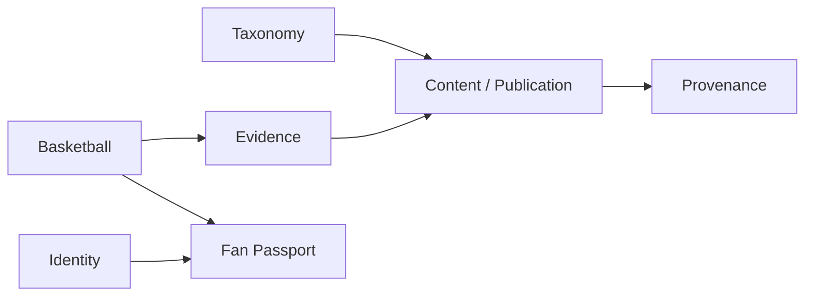

# Taiwan Basketball Domain

**Status**: T098–T104 implementation candidate; source activation and acceptance remain evidence-gated
**As of**: 2026-09-12
**Bounded context**: `basketball`

## Boundary

`basketball` 是台灣籃球事實、關係與時間線的 bounded context，負責回答「誰、在哪個聯盟／球隊、哪個賽季、哪次國家隊 campaign、依據什麼來源」；它不是內容分類器，也不是即時比分服務。

`taxonomy` 只負責 editorial navigation 與內容分類。Taxonomy 可以標記一篇文章與 `TPBL`、某球員或某賽季相關，但不能作為球隊參賽、球員生涯或國家隊名單的 canonical source。

2026-09-12 使用者要求開發剩餘 tasks 後，本輪已加入 domain aggregates、application ports、JDBC append-only catalog、evidence persistence、離線 normalization adapters 與 V020／V021 additive migrations。沒有加入 provider 網路擷取、排程抓取器或新的 public／write HTTP route；實際來源覆蓋與 production activation 仍須獨立驗收。

## Canonical entities

| Entity | Responsibility | Identity / history rule |
| --- | --- | --- |
| `League` | 聯盟、賽制組織與生命週期 | stable ID；名稱變更由 alias／label 表示 |
| `LeagueAlias` | 聯盟歷史名稱、縮寫、語系與顯示期間 | `validFrom`／`validTo`；不可因改名刪除舊名稱 |
| `Season` | 聯盟或競賽的賽季語境 | stable ID；保存官方 label 與 calendar period |
| `Team` | 球隊或代表隊的長期身份 | stable ID；解散不等於刪除 |
| `TeamAlias` | 球隊名稱、品牌、城市／語系與歷史 label | 有效期間與來源；文章可保留當時語境 |
| `TeamSeason` | 球隊在特定賽季／聯盟的參與關係 | 可表達加入、退出、跨聯盟、暫停與解散 |
| `Player` | 球員的 canonical identity | 絕不以姓名作 primary key |
| `PlayerAlias` | 姓名、羅馬拼音、語系、轉寫與歷史 label | `validFrom`／`validTo`；同名者不合併 |
| `PlayerTeamStint` | 球員在一支球隊／聯盟的時間段 | `startDate`、`endDate`、season、status、證據 |
| `NationalTeamCampaign` | 一個國家隊窗口、賽事週期或代表隊 campaign | 可區分男籃、女籃、青年、3x3 與競賽目標 |
| `NationalTeamRoster` | campaign 的培訓／正式名單快照 | immutable roster revision；不覆寫歷史名單 |
| `RosterEntry` | 球員在名單中的角色、狀態與異動 | 徵召、退出、傷病、替補與 effective date 有證據 |
| `Competition` | 比賽類型、國際賽窗口或賽季競賽 | 可連結 FIBA、亞洲盃、資格賽等外部語境 |
| `Tournament` | 具體賽事／屆次 | stable ID；保留官方名稱與 alias |
| `Game` | 比賽的雙方、時間、場地與競賽關聯 | 本輪不承諾即時 play-by-play |
| `Source` | 外部來源的責任主體與來源類型 | 官方、聯盟、球隊、媒體、訪談等 |
| `SourceSnapshot` | 某次擷取的不可變來源內容／metadata | snapshot 只新增，不在原地改寫 |
| `EvidenceRef` | canonical claim 指向來源 snapshot 的證據引用 | 包含 status、confidence、freshness 與時間欄位 |

### Player identity and timeline

```text
Player
 ├─ PlayerAlias[*]
 ├─ PlayerTeamStint[*]
 │   ├─ teamId
 │   ├─ leagueId
 │   ├─ seasonId
 │   ├─ startDate / endDate
 │   └─ status + EvidenceRef[*]
 └─ NationalTeamRoster / RosterEntry[*]
```

`PlayerTeamStint` 是完整生涯的 source of relationship。`Player.teamId` 不足以表示台灣 → 日本 → 中華隊 → 日本 → TPBL 的序列，因此不能作為 canonical career model。相同姓名、改名、轉寫或不同資料來源的 records 必須先透過 stable identity、alias、出生／球隊／賽季等可核對欄位與證據處理，不能靠字串相等自動合併。

### National team coverage

Domain 必須能表達中華隊男籃、女籃、青年代表隊、5-on-5 與 3x3，以及 FIBA 國際賽、亞洲盃、世界盃資格賽、奧運資格賽與國際賽窗口。campaign 與 roster 的 model 必須可記錄徵召、傷病、退出、替補、角色與戰術分析的證據狀態；分析不是官方 roster fact。

### League and team history

第一階段正式承諾 `TPBL`、`P. LEAGUE+ / PLG`、`SBL`。前端不得以聯盟名稱建立 hard-coded UI branch。資料 model 必須可表達：

- 聯盟或球隊更名、alias 與不同語系 label。
- 球隊加入、退出、暫停、解散、重組與跨聯盟。
- 同一聯盟在不同賽季的名稱與制度差異。
- 文章在歷史語境中使用當時名稱，而當前導覽可顯示可解釋的 canonical label。

未來 WSBL、UBA、HBL、基層、企業與街頭／社區籃球可沿用相同 boundary；本輪不宣稱已完成其資料覆蓋。

## Ingest and adapter boundary

Adapter 位於既有 Spring modular monolith 的 API application boundary 內：

```text
apps/api/basketball/
├─ domain/
├─ application/
├─ ports/
└─ adapters/
```

流程固定為：

```text
External Source
      ↓
Adapter
      ↓
SourceSnapshot
      ↓
Normalize
      ↓
Evidence validation
      ↓
Canonical Basketball Domain
```

候選 adapter 包含 `FibaAdapter`、`CtbaAdapter`、`TpblAdapter`、`PlgAdapter`、`SblAdapter` 與 overseas league adapters。Adapter 只能透過 port 產生 snapshot、normalization proposal 與 evidence；外部資料不得直接 overwrite production entity。衝突資料必須保留原始 snapshots，將 canonical claim 標記為 `DISPUTED` 或待審狀態。

## Module dependencies



這是 logical dependency，不是 service deployment topology。部署仍維持 Nuxt SSR/BFF → Spring Boot modular monolith → PostgreSQL、Transactional Outbox、S3-compatible storage 與 CDN。除非另有 ADR 與 scaling evidence，不建立 `basketball-service`、`evidence-service` 或其他 microservice。

## Implemented contract and verification

- `contracts/basketball-domain.schema.json`：UUID stable identity、required evidence、typed records、strict unknown-field rejection。
- `BasketballDomain`：名稱不是 ID；valid periods 採 `[startDate, endDate)`；空期間不合法。Alias rename 以新的 stable alias ID 與 `supersedesAliasId` 追加，舊文章仍可查當時名稱。Role、minutes、tactical position 未知時保持 `null`。
- `BasketballCatalog`：append-only identities、team-season 關係、排序後 career；stint 必須連到相同 league／season 的 team participation；roster revision 只能逐次增加並引用 predecessor。
- `BasketballCatalogService` + `JdbcBasketballFactStore`：在同一 database transaction lock 內 hydrate、validate、append，完整 retry 不重複寫入，變更同一 immutable ID 則拒絕；source evidence 與 identity kind 都需一致。
- `BasketballConfiguration`：有 DataSource 時建立 application beans；沒有啟動查詢或抓取。Canonical writes 和 human review 需 authenticated publisher／admin；review actor 必須與登入 identity 一致。
- `optionalProjection()`：domain storage 不可用時回傳無 enrichment；既有 article origin route 不依賴此 module。

`apps/api/src/test/resources/basketball/synthetic-history.json` 中 TPBL／P. LEAGUE+／PLG／SBL 只作 contract scenario labels；球員、球隊、國家隊與生涯均是明確 synthetic fixtures，不能視為真實資料覆蓋。

本輪 verification 範圍、migration forward／rollback 方法與尚待 CI 執行項目見 `basketball-implementation-review.md`。
