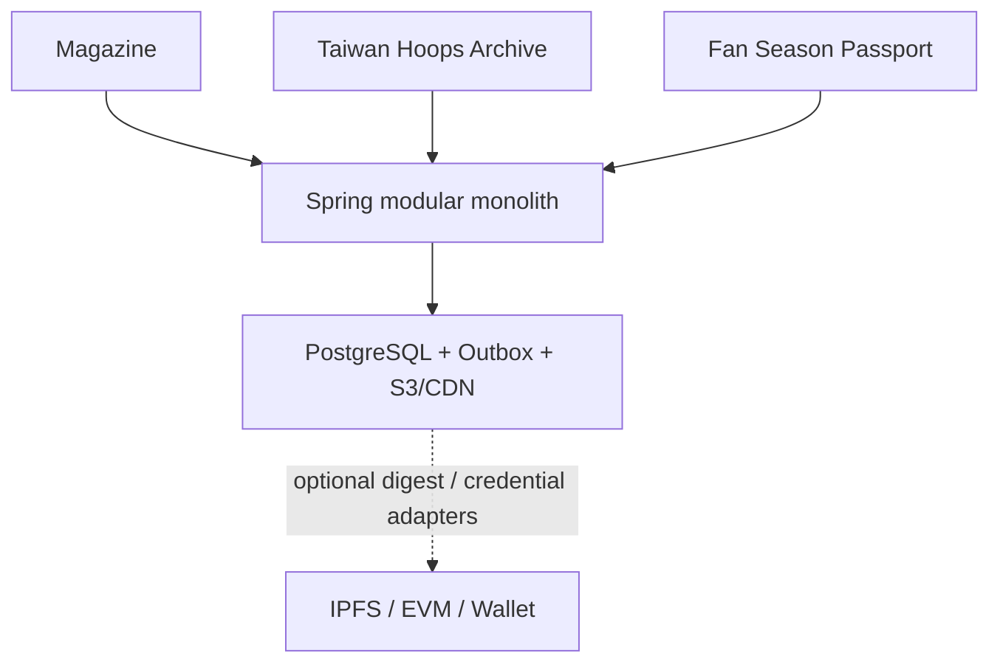

# Courtside TW Product Vision

**Status**: Product / architecture alignment draft v0.3  
**As of**: 2026-08-07  
**Working brand**: `Courtside TW`  
**Product capabilities**: Magazine · Taiwan Hoops Archive · Fan Season Passport

## Product promise

Courtside TW 將台灣籃球的當下賽事、人物故事、戰術脈絡與長期文化記憶放在同一個可閱讀、可追溯、可持續累積的出版系統中。

產品不是把即時比分、Web3 dashboard 與新聞流堆在一起，而是維持一條清楚的價值路徑：

```text
Home → Issue → TOC → Article
                 ↓
        Taiwan Hoops Archive
                 ↓
        Fan Season Passport
```

Web3 只提供出版來源驗證、可選 credential delivery 與收藏／身份的基礎設施。閱讀、SEO、出版與 rights gate 不依賴 wallet、token、NFT、IPFS、RPC、payment 或 blockchain。

## Product surfaces

| Surface | Purpose | Default access | Web3 dependency |
| --- | --- | --- | --- |
| Magazine | Issue、TOC、Article、Studio、publication revision | Public / anonymous / free | None |
| Taiwan Hoops Archive | 台籃 domain facts、歷史關係、證據與來源 freshness | Public read; editorial write | None |
| Fan Season Passport | Reader Stamp、活動、貢獻與 Season Recap | Optional OIDC identity | Off-chain first |
| Edition Provenance | 出版 snapshot 的 digest、revision、rights scope 與 attestation status | Public metadata | Optional; digest-only is valid |

## Delivery boundaries

### P1 — Public Magazine MVP

P1 只交付可持續出版與閱讀所需能力：

- Issue、TOC、Article、Studio、rights gate、immutable publication、revision、SEO、SSR、accessibility。
- Motion for Vue 與 bounded p5.js preset；保留 SSR poster、no-JS、reduced-motion 與 failure fallback。
- 公開閱讀 anonymous-first、free-first、SSR-first、mobile-first。

P1 不包含 Fan Passport claim、wallet、token、NFT、payment、marketplace、staking 或任何鏈上寫入。

### P2A — Taiwan Basketball Domain

建立 League、Season、Team、Player、National Team、Competition、Game、career timeline 與 evidence 關係。此層是 domain fact system，不由 `TaxonomyTerm` 取代，也不拆成 microservice。

### P2B — Evidence Layer

所有可被當作 canonical fact 的台籃資料都必須可回到 `SourceSnapshot` 與 `EvidenceRef`，有 claim status、freshness、retrievedAt、effectiveAt、confidence 與 contradiction handling。

### P2C — Data Adapters

以 `FibaAdapter`、`CtbaAdapter`、`TpblAdapter`、`PlgAdapter`、`SblAdapter` 與 overseas league adapters 連接外部來源。Adapter 只能產生 source snapshot 與 normalization proposal，不得直接覆寫 production canonical entity。

### P2D — Fan Passport Off-chain

以 OIDC／email identity 驗證 Reader Stamp eligibility，建立 off-chain entitlement、idempotent claim、revocation、supersede、wallet unlink 與 account deletion。

### P2E — Optional Web3 Credential

在 P2D proof 穩定後才評估 embedded／external wallet、sponsored transaction、credential adapter、gas ceiling、signer custody 與 revocation registry。非 transferability 與 no-investment representation 是預設。

### P3 — Archive and Season Recap

將個人或公開允許的季節統計轉成 recap、p5 poster、歷史照片、票根、口述歷史與 Archive Contributor record；不得把私人閱讀歷史直接公開上鏈。

## Product principles

1. **Reading first**：外部 provider、RPC、wallet、IPFS 或 chain failure 只能降低驗證／credential 能力，不能阻斷 Article。
2. **Taiwan-first, not league-first**：中華隊、旅外、TPBL、P. LEAGUE+、SBL 是同一個人才與文化系統的不同時間與組織節點。
3. **Evidence before opinion**：CONFIRMED、REPORTED、ANALYSIS、RUMOR、UNKNOWN 必須可區分；模型輸出不得升級證據等級。
4. **Rights before reach**：沒有 rights owner、license、allowed channels、validity 與 withdrawal policy，不得發布或鏡像。
5. **History is append-only**：更名、轉隊、撤回、修訂與衝突保留歷史，不以靜默覆寫取得表面一致。
6. **Passport is not money**：Fan Season Passport 是文化身份與貢獻紀錄，不是金融資產、投資商品或交易市場。
7. **Progressive enhancement**：Motion／p5 是可停用的 enrichment；SSR poster 與語意內容是完整產品。
8. **Small architecture**：Nuxt SSR/BFF → Spring modular monolith → PostgreSQL/outbox → S3/CDN 維持不變；拆服務必須有新的 ADR 與 scaling evidence。

## Architecture target



`Publication`、`Basketball`、`Evidence`、`Fan Passport` 與 `Provenance` 是分離 bounded contexts。`Provenance` 只描述出版版本是否與原始 snapshot digest 一致；`Fan Passport` 只描述讀者／球迷 credential、stamp、claim 與 season recap，不承接出版 manifest。

## Brand and design relationship

`Courtside TW` 是 working brand；`Taiwan Hoops Archive` 是 product capability，不是本輪 repository rename。正式 brand name、logo、字體與攝影 asset 仍需 brand／rights gate。

既有 `DESIGN.md` 的 Arena Night、Editorial Paper、Swiss Editorial Grid、Courtside Data、Procedural Signal、system-adaptive light/dark 與 mobile-first layout 全部保留。Passport 不導入 crypto neon、wallet-first、glassmorphism、jelly UI 或 dashboard-first navigation。

## Non-goals

- 即時比分 App、投機型球員卡、NFT marketplace、staking、yield 或 governance token。
- 用 wallet address 決定新聞真實性、編輯權限或閱讀資格。
- 將外部資料直接寫入 canonical domain，或以姓名作為 Player primary key。
- 以鏈上 permanence 覆蓋 rights withdrawal、privacy、account deletion 或內容下架政策。
- 在本輪實作 UI、database migration、API、wallet、smart contract、provider SDK、microservices 或 deployment。
