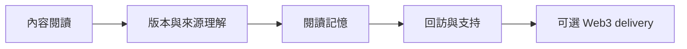

# Experimental User Research

**研究主題**：籃球數位雜誌 × Web3 的使用與商業價值  
**狀態**：EXPERIMENTAL／尚未取得真實參與者數據  
**版本**：v0.1.1 
**As of**：2026-08-27 
**Owner**：Product／Research／Engineering

## 研究定位

本資料夾把「使用者沉浸模擬」轉成可執行、可反駁、可重複的研究計畫。現有簡報、產品文件與 UI montage 是設計輸入與研究假設，不是實際使用者結果。

核心問題不是「球迷會不會用 NFT 或錢包」，而是：

> Web3 是否能在不傷害閱讀體驗的前提下，提升球迷的記憶連續性、回訪、支持意願與出版信任？

研究順序固定為：

Web3 只能在前一層價值被證明後出場；它不能成為匿名閱讀、期刊目錄、文章正文或 rights gate 的前置條件。

## 文件索引

| 文件 | 用途 | 證據狀態 |
| --- | --- | --- |
| [`001-web3-magazine-user-research-method.md`](./001-web3-magazine-user-research-method.md) | 研究問題、假設、樣本、指標、分析與 Go／Hold／Cancel 判準 | 待執行 |
| [`002-experiment-protocol.md`](./002-experiment-protocol.md) | P1 prototype、分組、任務腳本、事件契約與研究執行流程 | 待執行 |
| [`003-source-artifact-index.md`](./003-source-artifact-index.md) | 附件、設計模擬與產品 brief 的來源索引及限制 | 已整理，非實測證據 |
| [`stage-a-pretest/`](./stage-a-pretest/) | Issue #110 六人 T1/T2 pretest 的 screener／consent placeholders、主持腳本、任務卡、觀察表、分母規則、分析表與決策收據 | Kit ready；尚未招募或執行 |
| [`assets/`](./assets/) | 原始或整理後的研究輸入素材 | 研究輸入 |

## 已知、未知與禁止推論

### 已知

- `Issue → TOC → Article`、anonymous-first、free-first、SSR-first 是現有產品邊界。
- ADR-0006 已接受 manifest-only provenance 起始邊界；IPFS、chain、SIWE、signer 與 external write 預設關閉。
- ADR-0008 仍是 proposed boundary；Fan Season Passport 應先 off-chain，且不代表 token、金融資產或 ownership。
- 現有附件描述的是目標體驗與設計審查；它們沒有產生參與者成功率、回訪率或付款數據。

### 尚未知

- 使用者是否真的先把產品理解成台籃數位雜誌／文化檔案。
- Reader Stamp 或 Season Passport 是否增加回訪、故事線記憶或支持行為。
- provenance 文案是否被理解為「版本一致」，而非「內容必然正確」。
- 一般台籃球迷是否願意使用 wallet 或 credential delivery。
- 使用者是否願意以真實付款支持內容，而非只在問卷中表達興趣。

### 禁止推論

- 不得把簡報分數當成 usability metric。
- 不得把意向問卷當成收入證據。
- 不得把 wallet 連接、徽章領取或 page view 當成商業價值本身。
- 不得把鏈上 digest、CID 或 credential 解釋成內容真實、權利永久有效或投資價值。

## 與既有專案契約的關係

研究文件不授權 runtime implementation、database migration、wallet SDK、smart contract、payment、marketplace 或 production activation。任何後續實作仍須回到既有 spec、ADR、rights gate、security gate 與 tests-first 流程。

研究完成的定義是：

1. 研究參與者完成同一套預先登錄的任務與分組流程。
2. 結果分開保存定量資料、質性觀察、限制與反例。
3. 根據 Go／Hold／Cancel 判準留下 decision receipt。
4. 未通過閱讀與信任 guardrail 時，停止擴大 Web3 public UI。
