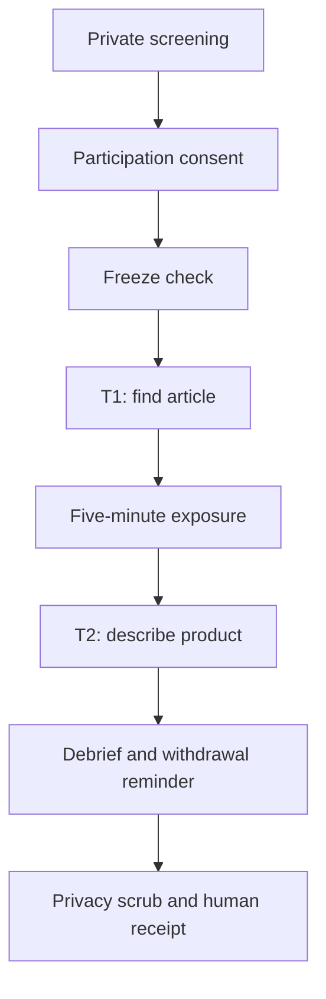

# Issue #110 — Stage A runnable pretest kit

**Status**: KIT READY / STUDY NOT RUN 
**Scope**: six-person moderated pretest; T1 and T2 only 
**Evidence state**: no recruitment, consent record, participant observation, measured result, or decision receipt exists 
**Related protocol**: [`../002-experiment-protocol.md`](../002-experiment-protocol.md) 
**Related issue**: [GitHub issue #110](https://github.com/bynanci/courtside-tw/issues/110)

This directory makes Stage A executable once an accountable research owner staffs the study and fills every required placeholder. It does not recruit participants, authorize contact, record consent, or contain participant findings. Automated tests, browser runs, screenshots, simulations, AI output, and multi-agent output may help review this kit, but none can occupy a participant slot or be labeled `PARTICIPANT_OBSERVATION`.

Within the parent research method, issue #110 `Stage A` is the six-person `P0` moderated pretest. This kit is the operational authority for that bounded layer only.

## Authority boundary

### In scope

- Retain exactly six screened, consented adults using the preregistered segment quotas; screening and valid replacements may involve more than six people.
- Run the same frozen prototype and environment for T1 and T2.
- Record pseudonymous, minimum-necessary task observations in approved restricted storage only.
- Calculate the preregistered descriptive metrics and uncertainty.
- Produce a human-owned Stage A `GO`, `HOLD`, or `CANCEL` receipt.

### Not authorized by this kit

- Recruiting, contacting, scheduling, or compensating anyone.
- Treating an AI, agent, bot, test account, simulated persona, or team member as a participant.
- Running T3–T6, Web3, provider-failure, wallet, payment, retention, or production research.
- Enabling production, changing providers, using secrets, or publishing identifiable data.
- Closing issue #110, unblocking Stage B, or claiming product or market validation.

## Files and run order

| Order | File | Owner action |
| ---: | --- | --- |
| 1 | [`01-screener-and-consent.template.md`](./01-screener-and-consent.template.md) | Fill all owner, contact, storage, retention, deletion, and compensation placeholders before recruitment. Obtain any required privacy, ethics, or legal review. |
| 2 | [`05-denominator-and-decision-rules.md`](./05-denominator-and-decision-rules.md) | Freeze the sample, task, metric, missing-value, and decision rules before the first session. |
| 3 | [`02-moderator-script.md`](./02-moderator-script.md) | Freeze the exact commit, environment, target article, variant, and session configuration. Run the neutral script without revealing the T2 classification labels. |
| 4 | [`03-t1-t2-task-cards.md`](./03-t1-t2-task-cards.md) | Show only the participant-facing card for the active task. Keep the moderator criteria hidden. |
| 5 | [`04-observation-sheet.template.md`](./04-observation-sheet.template.md) | Make one restricted working copy per participant; never commit a completed row. |
| 6 | [`stage-a-analysis.template.csv`](./stage-a-analysis.template.csv) | Copy outside the repository, populate from retained human sessions only, and keep the completed row-level table restricted. |
| 7 | [`06-go-hold-cancel-receipt.template.md`](./06-go-hold-cancel-receipt.template.md) | Copy, complete, and sign the receipt; never overwrite the template or infer missing evidence. |

## Hard readiness gate

Do not recruit or start a session until every item is true:

- [ ] Accountable research owner and moderator are named in the private study record.
- [ ] The participant-facing pre-screener privacy notice, screen-out deletion route, and acknowledgment are complete.
- [ ] Segment quotas use the blinded study-independent source; the direct invitation/screener does not expose Taiwan basketball or classification labels.
- [ ] Consent text is complete and its version is frozen.
- [ ] Consent discloses the restricted verbatim-text capture of the first T2 response required for scoring; optional audio, screen recording, and report-quote permissions remain separate.
- [ ] Recording choices are separate, optional, and default to off.
- [ ] Private systems, access roles, retention dates, deletion route, contacts, and compensation rules are filled.
- [ ] Exactly one target article title and stable identifier are frozen; the title/task wording does not itself state a publication/Web3 classification label.
- [ ] Prototype commit, deployment identifier, URL, environment, baseline Variant `A`, locale, device/browser policy, and capture configuration are frozen.
- [ ] The T1 completion signal, bounded neutral-prompt cadence, common exposure instruction, 120-second T2 response window, and all terminal outcome codes are rehearsed exactly.
- [ ] T1 and T2 participant cards are rendered into separate participant-only views; the moderator-only source is never screen-shared.
- [ ] Entry state is resettable and identical across sessions.
- [ ] Completed screeners, consent/linkage records, contact data, participant/session keys, row-level sheets/CSVs, permission choices, signatures, recordings, transcripts, paraphrases, dates, device/accommodation details, and small-cell cross-tabs cannot enter this public repository.
- [ ] Deletion-resolution linkage is retained through the withdrawal cutoff; artifact inventory, cascade deletion, deletion log, backup expiry, and restore-time deletion replay are defined.
- [ ] Any result receipt remains private through the withdrawal cutoff; the only possible public result is the privacy-reviewed aggregate allowlist with cells below 3 suppressed/combined.
- [ ] Moderator and observer have rehearsed with non-participant fixtures only; rehearsal output is labeled `SIMULATED_EXPERIENCE` and excluded from all study denominators.
- [ ] T1/T2 coding, missing-value, environment-invalidation, and decision rules are frozen.
- [ ] The prototype remains readable without login, wallet, payment, or an external provider.

If any item is false, the study state is `HOLD`. Filling a template is preparation evidence, not participant evidence.

## Session sequence

T2 must be captured before the study-specific invitation, direct screener, consent, moderator, or task card uses any of these labels: `Taiwan basketball`, `magazine`, `archive`, `news feed`, `membership`, `crypto`, `Web3`, `wallet`, or their Chinese equivalents. Segment attributes come from the blinded study-independent source.

## Evidence labels

| Label | Allowed use in this kit |
| --- | --- |
| `RESEARCH_METHOD` | Script, task definition, denominator rule, blank template |
| `HUMAN_SCREENING_AGGREGATE` | Restricted human-derived screening/flow counts; never method evidence and public small cells are suppressed |
| `HUMAN_CONSENT_RECORD` | Private participation/permission evidence and linkage; never commit the artifact or participant-level state |
| `SIMULATED_EXPERIENCE` | Moderator rehearsal or automated review; never a participant row |
| `IMPLEMENTATION_EVIDENCE` | Commit, deployment, browser, accessibility, CI, or security proof |
| `PARTICIPANT_OBSERVATION` | Restricted row from a retained, consented real person; never committed |
| `PARTICIPANT_AGGREGATE` | Post-cutoff, privacy-reviewed overall metrics allowed by the public receipt schema |
| `BEHAVIORAL_EVENT` | Not collected in Stage A; any later use requires a separate data contract |

The final receipt must list these evidence classes separately. Supporting engineering evidence cannot be promoted to participant evidence.
