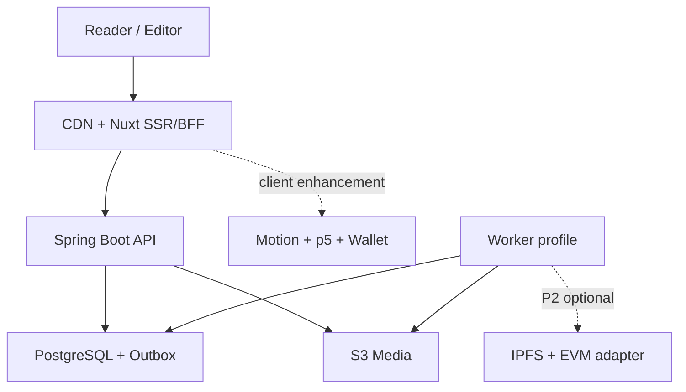
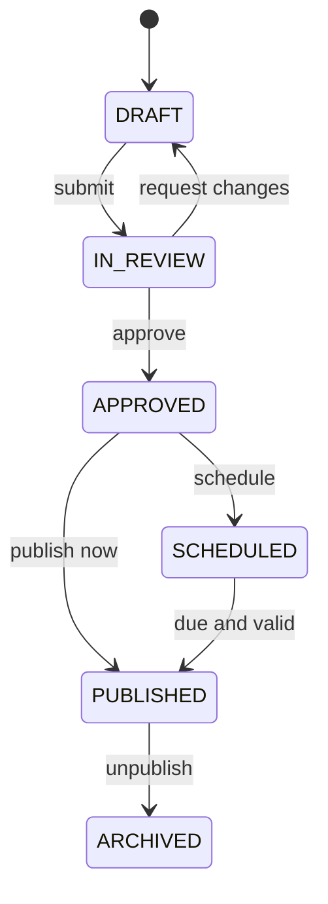

# Implementation Plan: 台灣籃球雜誌電子書

**Branch**: `001-taiwan-basketball-magazine-ebook` | **Date**: 2026-08-06 | **Spec**: `specs/001-taiwan-basketball-magazine-ebook/spec.md`  
**Input**: Feature specification from `/specs/001-taiwan-basketball-magazine-ebook/spec.md`

## Summary

以「公開閱讀優先、出版流程可追溯、媒體權利先於發布」為核心，建立一個 Mobile-first 數位雜誌平台。公開期刊與文章由 Nuxt SSR 輸出，Spring Boot modular monolith 負責內容版本、審稿、發布、媒體權利、搜尋、收藏與稽核；PostgreSQL 保存交易資料與結構化內容文件，S3 相容儲存保存原始媒體與公開衍生檔。

體驗層以 Motion for Vue 提供克制、可關閉的 editorial motion，並以 p5.js 2.x 實作一種 schema-constrained `generative-canvas` block。Web3 採 progressive decentralization：先產生可重現的 publication manifest 與 digest，再以可替換 adapter 選擇性發布 IPFS CIDv1、EVM-compatible 存證與 SIWE；核心閱讀、SEO、OIDC 與出版 workflow 不依賴鏈、錢包或 gateway。

MVP 採三個可獨立驗收的 P1 slice：

1. 匿名讀者瀏覽期刊並開始閱讀。
2. 讀者完成具靜態 fallback、reduced-motion 與基礎生成式視覺的長篇文章閱讀與期刊內導覽。
3. 編輯團隊完成草稿到發布／下架的受控工作流。

搜尋、帳號收藏／續讀、Taiwan Basketball Domain、Evidence、Fan Season Passport 與可選 Web3 provenance／credential 列為分離的 P2 increments；離線期刊與 Season Recap 列為 P3。付款、付費牆、NFT、代幣、token gate、留言、即時比分與原生 App 不進入此 feature。

## Technical Context

| Item | Decision |
| --- | --- |
| Frontend language/runtime | TypeScript strict mode；Node.js 24 LTS |
| Frontend framework | Nuxt 4.5.x、Vue 3、Vite 8；公開頁 SSR，後台採 client-enhanced SSR |
| Backend language/runtime | Java 21 LTS；Spring Boot 4.1.x |
| Architecture | Monorepo；Nuxt web + Spring Boot modular monolith；同一 API artifact 可用 `api`／`worker` profile 執行 |
| API | REST + OpenAPI 3.1；錯誤使用 RFC 9457 Problem Details；generated TypeScript client |
| Storage | PostgreSQL 18；S3-compatible object storage；CDN |
| Content model | Versioned block document（JSON Schema + JSONB），禁止任意 HTML 成為 canonical source |
| Motion | Motion for Vue (`motion-v`，官方文件基準 v13)；只用於 page／layout transition、TOC reveal、progress feedback 與明確 gesture，簡單 hover/focus 優先 CSS |
| Generative visual | p5.js 2.x；Nuxt client-only dynamic import、instance mode、fixed seed、schema-bounded preset、SSR poster／summary fallback，不接受任意 JavaScript／shader |
| Authentication | OIDC Authorization Code + PKCE；Nuxt BFF session 使用 Secure/HttpOnly/SameSite cookie；Spring Security 驗證 JWT |
| Optional Web3 | EIP-1193 provider boundary + ERC-4361 SIWE；framework-agnostic `viem` adapter；RFC 8785 JCS manifest；`CIDv1/raw/sha2-256` mirror；EVM-compatible digest registry behind feature flags |
| Search | PostgreSQL `pg_trgm` + normalized search document；以 curated zh-TW query set 驗證，達取消條件才導入專用搜尋服務 |
| Background work | PostgreSQL transactional outbox + worker profile；資料庫鎖確保排程冪等，MVP 不引入 message broker |
| Frontend testing | Vitest、Vue Test Utils、Playwright、axe-core、Lighthouse CI |
| Backend testing | JUnit 5、Spring Boot Test、Testcontainers、ArchUnit、REST Assured |
| Contract testing | OpenAPI lint/diff、generated client compile、API integration tests |
| Performance testing | k6 public-read scenario + production Core Web Vitals RUM |
| Deployment target | Container platform + managed PostgreSQL + S3-compatible storage + CDN；供應商保持可替換 |
| Observability | OpenTelemetry、Micrometer、structured JSON logs、request/trace ID、SLO alerts |
| Scope | 首年 <10,000 篇文章；每月 ≤4 期；每期 ≤50 篇；單一品牌、單一編輯團隊 |

### Version Baseline Verification

版本基準於 2026-08-06 依官方來源確認：Nuxt 4.5 已發布且使用 Vite 8；Spring Boot 官方穩定頁顯示 4.1.0；Node.js 24 為 LTS；PostgreSQL 18 為 current、19 仍為 beta；Motion 官方文件為 v13 且 Vue package 為 `motion-v`；p5.js 官方文件與 tutorials 已以 2.x 為基準。EIP-1193 與 ERC-4361 均為 Final；實作時鎖定相容 patch 版本，不追逐 RC／beta，Web3 provider 套件升級需重跑 wallet／signature regression suite。

## Constitution Check

目前 `.specify/memory/constitution.md` 已正式存在，狀態為 `RATIFIED`、版本 `0.1.0`，並由 T001／PR #2 的明確核准與 main read-back 生效。T002 的 ADR-0001～0006 亦已由 PR #4 合併並標記為 `ACCEPTED`；其 approval gate 與 rights-owner／provider 等尚未具體化的內容，仍是後續 production publish 的明確前置條件，不是可被程式碼默認的例外。

| Gate | Rule | Status |
| --- | --- | --- |
| Spec traceability | 每個 API、資料表、畫面與測試可追溯到 FR／User Story；不得由 task 私自擴大 MVP | T085 CONTROLLED — `traceability.md` 為可執行來源；open／proxy／human／future deviations 不得被 design-time PASS 隱藏 |
| Contract first | OpenAPI 與 Content JSON Schema 先於前後端功能；generated client 不手改 | PASS |
| Immutable publication | 已發布內容不可原地覆寫；發布／撤回原子化且具 audit trail | PASS |
| Rights before reach | 缺少有效授權與署名的媒體不得送審或發布；撤回高於快取可用性 | PASS |
| Testable slices | 每個 P1 User Story 先建立失敗的 contract／integration／E2E 測試再實作 | PASS |
| Accessible and fast | WCAG 2.2 AA 與 Core Web Vitals 是 release gate，不是發布後 backlog | PASS |
| Progressive enhancement | Motion／p5.js 不得隱藏 SSR 內容；reduced-motion、無 JS、canvas failure 都有完整 fallback | PASS |
| Least privilege | OIDC、RBAC、BFF session、短效上傳 URL；草稿與原始媒體預設不公開 | PASS |
| Web3 least agency | 不要求錢包、不持有讀者私鑰、不把個資／草稿／可撤回媒體上鏈；所有外部寫入經 outbox、feature flag 與人類核准的 provider ADR | PASS |
| Operational recovery | 冪等 worker、可觀測性、RPO 24h／RTO 4h 與還原演練必須在 GA 前驗證 | PASS |
| Simplicity budget | MVP 不引入 message broker、專用搜尋叢集、microservices 或付費系統 | PASS |

**Gate result**: `PASS`. T001 constitution 與 T002 ADR approval 已完成；Phase 1（T001–T008）可進入 Phase 2，但每個後續 contract／implementation task 仍必須逐項通過其自己的 evidence-backed gate。

## Architecture



### Runtime Responsibilities

#### Nuxt Web/BFF

- SSR 公開首頁、期刊、文章、搜尋與 SEO metadata。
- 渲染經 JSON Schema 驗證的內容 block；不使用 `v-html` 渲染 canonical content。
- 以 `motion-v` 建立不改變語意的動態 pattern，啟動前檢查 reduced-motion；hydration 前不隱藏 SSR 內容。
- 以 Vue client-only boundary 動態載入 p5.js instance；由 renderer 傳入經驗證 preset／seed／parameters，visibility 或 route 改變時 pause／dispose。
- 提供後台 UI、OIDC callback 與 Secure/HttpOnly session。
- P2 提供 EIP-1193 wallet adapter 與 SIWE challenge UI；wallet state 不進 Pinia durable state，account／chain change 使相關 session 失效或重新驗證。
- 對 Spring API 使用 generated client；不得自行拼接隱性 API contract。
- 提供匿名閱讀進度的 local adapter，登入後透過明確合併流程同步。
- P3 才啟用 offline issue manifest 與 service worker content cache。

#### Spring Boot API

- 擁有 Publication、Content、Media、Taxonomy、Basketball、Evidence、Identity、Reader Library、Fan Passport、Search、Provenance、Audit 模組。
- 驗證狀態轉換、角色權限、媒體權利、樂觀鎖與發布交易。
- 建立不可變 ArticleRevision 與公開 revision pointer。
- 產生簽章上傳意圖、確認 checksum／MIME／尺寸與媒體處理狀態。
- 只公開可發布投影，不讓 public endpoint 查詢 draft entity graph。
- 將索引、媒體處理、排程發布、撤回與 CDN invalidation 事件寫入 outbox。
- 產生 deterministic publication manifest，保存 digest 與 provenance 狀態；不直接在 request transaction 呼叫 RPC、pinning 或公鏈。

#### Worker Profile

- 與 API 共用 artifact 與 domain code，但以不同 process profile 執行。
- 以 claim + lease + idempotency key 消費 outbox，不依賴單機 scheduler 正確性。
- 執行媒體衍生圖、metadata 清除、排程發布、搜尋投影更新、撤回與 cache purge。
- P2 以獨立 job 發布符合 rights policy 的 manifest／CID 與 chain digest；使用 managed signer／KMS 邊界，private key 不進 app config、DB、prompt 或普通日誌。
- 工作失敗採 bounded retry + dead-letter state；超過門檻告警，不無限重試。

### Module Boundaries

| Module | Owns | May depend on |
| --- | --- | --- |
| `identity` | OIDC subject mapping、roles、authorization policy | audit |
| `publication` | issues、sections、issue ordering、state transitions、publication jobs | content、media、identity、audit、outbox |
| `content` | articles、revisions、content validation、contributors | taxonomy、media、audit |
| `media` | assets、variants、rights records、upload lifecycle、revocation impact | identity、audit、outbox |
| `taxonomy` | content classification terms、aliases、historical labels、relationships | audit |
| `basketball` | canonical league／season／team／player identity、aliases、stints、national-team campaigns、competition／game | taxonomy、evidence、audit |
| `evidence` | sources、immutable snapshots、EvidenceRef、status、freshness、contradiction review | basketball、audit、outbox |
| `search` | public search projection、query normalization、ranking | publication events、taxonomy |
| `readerlibrary` | bookmarks、reading progress、account erasure | identity、publication |
| `analytics` | consent-aware minimal product events and retention controls | identity、publication |
| `fanpassport` | Reader Stamp、Issue Stamp、event／archive contribution、claim、revoke、supersede、season recap、wallet link | identity、publication、basketball、rights、audit、outbox |
| `provenance` | Edition Provenance：canonical publication manifests、CID／chain attestation status | publication、media、rights、audit、outbox |
| `audit` | append-only security and publication events | none |
| `outbox` | durable domain event delivery and worker lease | none |

模組只能透過 application service／domain event 互動；禁止跨模組 repository 直接 join 後修改他模組 aggregate。讀取型投影可透過明確 SQL view 或 read repository 組合，但不得繞過公開狀態規則。

## Critical Data Design

### Aggregate and Revision Strategy

- `article` 是穩定 identity，包含 `draft_revision_id`、`published_revision_id` 與 `version`。
- `article_revision` 一旦建立即不可變；編輯儲存會建立新 revision 或更新尚未提交審稿的 working draft，送審後凍結。
- `publication_issue` 保存 `published_version`；`issue_publication_snapshot` 固定當次公開目錄與文章 revision IDs。
- 公開 endpoint 只讀 snapshot／published pointer，避免排程發布時讀到半完成狀態。
- 所有 aggregate 使用 UUIDv7／時間排序 UUID，外部 API 不暴露自增序號。
- 所有寫入帶 `version`／`If-Match`；衝突回傳 `409` 與目前版本，不採 last-write-wins。

### Tables

| Table | Purpose | Important constraints |
| --- | --- | --- |
| `publication_issue` | 期刊 identity 與 workflow | unique `slug`; state check; optimistic `version` |
| `issue_section` | 目錄章節與排序 | unique `(issue_id, position)` |
| `article` | 文章 identity 與 revision pointers | unique `slug`; published pointer FK |
| `article_revision` | 不可變內容版本 | unique `(article_id, revision_no)`; JSON schema version |
| `issue_article` | 期刊目錄關聯 | unique `(issue_id, article_id)` and `(section_id, position)` |
| `issue_publication_snapshot` | 原子公開快照 | immutable payload + checksum + published_at |
| `contributor` / `article_contributor` | 作者與角色 | stable public slug; ordered credits |
| `media_asset` | 媒體 identity、storage key、processing state | checksum; MIME allowlist; no public original key |
| `media_variant` | 公開衍生尺寸 | unique `(asset_id, variant)` |
| `rights_record` | 署名與授權狀態 | channel/date validation at review and publish |
| `taxonomy_term` / `taxonomy_alias` | 非硬編碼分類與歷史名稱 | type + normalized name + validity range |
| `article_taxonomy` | 文章分類關聯 | unique `(article_id, term_id)` |
| `reader_profile` | 最小 OIDC subject mapping | unique `(issuer, subject)` |
| `bookmark` | 收藏 | unique `(reader_id, article_id)` |
| `reading_progress` | revision-aware 續讀 | unique `(reader_id, article_id)`; bounded percent |
| `search_document` | 已發布搜尋投影 | no draft content; versioned source checksum |
| `outbox_event` | durable async work | unique idempotency key; lease and retry fields |
| `audit_event` | append-only audit trail | no update/delete app permission |
| `publication_provenance` | Edition Provenance manifest digest、CID、chain reference、verification／withdrawal state | unique `(snapshot_id, manifest_version)`; no body or PII |
| `fan_passport` / `reader_stamp` | off-chain Fan Season Passport entitlement、stamp、claim and lifecycle | identity／season／condition idempotency; no P1 gate |
| `wallet_identity_link` | optional, consented and revocable fanpassport／identity relation | unique normalized chain namespace + address; identifiable information |
| `siwe_challenge` | optional fanpassport identity delivery nonce | hashed nonce; single use; domain／chain／expiry binding; never editor authorization |

### Content Document Contract

Canonical content 使用 `content-document.schema.json`，最外層至少包含：

```json
{
  "schemaVersion": 1,
  "documentId": "uuid",
  "blocks": [
    {
      "id": "uuid",
      "type": "paragraph",
      "version": 1,
      "payload": {}
    }
  ]
}
```

規則：

- 每一 block type 都有獨立 schema、Nuxt renderer、editor extension 與 fixtures。
- API 在接受寫入時做 JSON Schema 驗證、URL protocol allowlist、文字與陣列長度限制。
- 純文字搜尋投影由可信 server extractor 產生，不接受 client 直接提供。
- media block 只保存 `assetId` 與展示選項，不保存任意外部 HTML。
- iframe 僅允許明確 provider 與 canonical embed URL；無法識別時降級為外部連結。
- `generative-canvas` 僅保存 `presetId`、`seed`、bounded numeric／enum parameters、`posterAssetId`、alt text 與非視覺摘要；不得保存 source code、shader、callback 或任意遠端 URL。
- p5 preset registry 是受版本控制的 trusted code；未知 preset／version 以 poster 與摘要安全降級，不由內容 payload 動態 import module。
- schema migration 必須是可重跑的純轉換，保留原 revision 與 migration evidence。

## Publication Lifecycle



### Publication Transaction

1. 驗證 actor role、aggregate version、issue completeness、article approval 與 media rights。
2. 鎖定 issue aggregate，建立 publication snapshot 與 checksum。
3. 原子切換 issue/article public pointers，寫 audit event 與 outbox events。
4. commit 後 worker 更新 search projection、sitemap signal 與 CDN purge。
5. public cache 最長 60 秒；撤回事件優先 purge，失敗即告警並持續 bounded retry。

相同 `Idempotency-Key` 重試只能取得同一 operation result。排程到期不代表一定發布；任何權利或核准條件在執行當下失效，job 轉 `BLOCKED` 並列出原因。

## API Contract Surface

所有 endpoint 以 `/api/v1` 為前綴，公開與受保護資源分離。以下是最小 contract，完整 OpenAPI 由 T011 建立。

### Public

| Method | Path | Result |
| --- | --- | --- |
| `GET` | `/public/issues` | cursor-paginated published issue summaries |
| `GET` | `/public/issues/{issueSlug}` | issue metadata + visible ordered TOC |
| `GET` | `/public/articles/{articleSlug}` | published article projection + issue navigation |
| `GET` | `/public/search` | query + filters + cursor-paginated results |
| `GET` | `/public/taxonomy/{type}` | active public filter terms |
| `GET` | `/public/withdrawals` | signed/versioned offline withdrawal manifest |
| `GET` | `/public/issues/{issueSlug}/provenance` | manifest digest、CID、attestation and verification status; never gates content |

### Reader

| Method | Path | Result |
| --- | --- | --- |
| `GET` | `/me/bookmarks` | current reader bookmarks |
| `PUT` / `DELETE` | `/me/bookmarks/{articleId}` | idempotent bookmark state |
| `GET` | `/me/progress` | current reader progress list |
| `PUT` | `/me/progress/{articleId}` | revision-aware progress upsert |
| `POST` | `/me/progress:merge` | explicit local/server merge preview + apply |
| `POST` | `/auth/siwe/challenge` | short-lived domain／chain-bound nonce and ERC-4361 message fields |
| `POST` | `/auth/siwe/verify` | signature verification and optional BFF session link |
| `DELETE` | `/me/wallets/{chainNamespace}/{address}` | revoke off-chain wallet link after re-authentication |
| `DELETE` | `/me` | verified account deletion workflow |

### Editorial

| Method | Path | Result |
| --- | --- | --- |
| `POST/GET/PATCH` | `/editor/issues` | issue draft CRUD with `If-Match` |
| `POST/GET/PATCH` | `/editor/articles` | article identity and revision CRUD |
| `POST` | `/editor/articles/{id}:submit` | rights/content validation + review transition |
| `POST` | `/publisher/articles/{id}:approve` | approve frozen revision |
| `POST` | `/publisher/issues/{id}:publish` | immediate idempotent publish |
| `POST` | `/publisher/issues/{id}:schedule` | schedule using explicit timezone input |
| `POST` | `/publisher/articles/{id}:withdraw` | emergency withdrawal with reason |
| `POST` | `/editor/media/uploads` | signed upload intent |
| `POST` | `/editor/media/{id}:complete` | checksum/MIME confirmation and processing enqueue |
| `POST` | `/publisher/media/{id}:revoke` | rights revocation + impact report |
| `POST/GET/PATCH` | `/editor/taxonomy` | taxonomy management |

### Error Contract

- `application/problem+json` with `type`, `title`, `status`, `detail`, `instance`, `requestId`, `code`.
- Validation failures add stable field errors;不得把 stack trace、SQL 或草稿內容放進 response。
- `409` 用於 version conflict、state conflict、slug conflict。
- `422` 用於內容／rights gate 不通過，回傳 stable blocking codes。
- `429` 包含 retry hint；登入與上傳採更嚴格的 separate buckets。

## Frontend Information Architecture

### Public routes

- `/`：最新一期 hero、期刊列表、精選文章與主題入口。
- `/issues`：過往期刊列表。
- `/issues/[issueSlug]`：期刊封面、簡介與分章目錄。
- `/articles/[articleSlug]`：文章 reader、進度、期刊導覽與相關內容。
- `/search`：關鍵字、分類 filters、結果與空狀態。
- `/library`：登入後收藏與續讀。

### Editorial routes

- `/studio/issues`、`/studio/issues/[id]`
- `/studio/articles`、`/studio/articles/[id]`
- `/studio/review`
- `/studio/media`、`/studio/taxonomy`
- `/studio/audit`

### UI architecture

- `features/*` 擁有 use case、view model、components 與 tests；`components/ui` 只放無領域語意元件。
- 公開頁使用 server data fetching；同一 request 不重複由多個 component 拉資料。
- Pinia 僅保存跨 route 的 ephemeral client state；server state 由 Nuxt data utilities 管理。
- Design tokens 集中在 CSS custom properties；文章 typography 與 Studio dense UI 使用不同 token layer。
- 圖片固定 width/height 或 aspect-ratio，使用 `srcset`、lazy loading 與 dominant placeholder 控制 CLS。
- 閱讀進度以 block anchor 為主、百分比為輔，避免字級或 viewport 改變後定位失真。

### Editorial experience direction

視覺定位採「當代運動編輯設計」，不套用常見的加密貨幣霓虹 dashboard。Edition Provenance 與 optional Fan Passport status 只出現在次要的來源／身份抽屜，封面、目錄、正文與閱讀 CTA 仍以籃球內容為主。

| Surface | Layout / visual role | Motion baseline | p5.js baseline | Static / reduced fallback |
| --- | --- | --- | --- | --- |
| Home / latest issue | 大型封面、非對稱標題、3 個以下主入口 | cover reveal + restrained stagger | none by default | 完整 SSR cover and links |
| Issue detail | 封面、期號、主題、分章 TOC | cover-to-detail shared layout | optional `court-pulse-v1` poster hero | fixed poster + semantic TOC |
| Article | 窄正文欄、寬媒體 breakout、sticky progress | progress interpolation + intentional block reveal | editorial-insert `generative-canvas` only | poster、alt text、data summary |
| Edition Provenance | digest／CID／chain status 的 compact evidence panel | status transition only | none | text status + copyable references |
| Studio preview | 與公開 renderer 同源、參數表單在旁 | no decorative route motion | fixed-seed preview with explicit play/pause | generated poster preview |

首個候選 preset 為 `court-pulse-v1`：以球場線條、投籃落點／文章數據與雜誌色票生成可重現的抽象圖。允許參數只包含 `density`、`tempo`、`lineWeight`、`paletteId` 與經 server 驗證的非個資數值序列；發布時以同 seed 產生 poster，preset 未通過 ADR／效能驗證則只交付 poster，不啟動 animation。

### Motion system

- 動態語彙限於 3–5 個具用途的 patterns：route fade/slide、issue-cover shared layout、TOC stagger、reading-progress interpolation、button／gesture feedback。
- 尺寸、位置或內容重排才使用 Motion；單純 color、opacity hover／focus 優先 CSS transition，避免把 runtime animation library 當萬用調味料。
- 所有 pattern 由 `features/motion/variants.ts` 集中輸出 duration、easing、spring 與 reduced-motion variants；feature component 不自行散落 magic numbers。
- SSR DOM 必須是最終可讀狀態。Motion 只能從完成狀態開始增強，不得用 `opacity: 0` 等待 hydration。
- route transition 不綁定資料取得完成；錯誤、慢 API 或 hydration failure 不能讓頁面卡在中間狀態。

### p5.js creative runtime

- 只採 instance mode，每個 block 由 `P5CanvasHost.vue` 擁有 mount、resize、pause、resume、remove lifecycle；禁止 global mode 汙染 `window`。
- preset interface 固定為 `createSketch({ seed, params, palette, reducedMotion })`；schema 先 clamp 數值、限制 palette／mode enum，再傳入 trusted preset。
- p5.js 與 preset 皆 dynamic import；IntersectionObserver 接近一個 viewport 才下載，document hidden／離開 viewport 時 `noLoop()`，route unmount 時 `remove()`。
- reduced-motion 預設不自動播放；使用 poster 或單幀 `redraw()`，若互動有實質資訊則提供明確「啟用互動」按鈕。
- canvas 同層提供可聚焦說明、資料摘要與下載／查看靜態圖入口；canvas 本身不可成為唯一資訊來源。

## Web3 Boundary (P2, optional)

Web3 採 hexagonal adapter，不改變 publication aggregate 的權威性：

1. `PublicationService` 完成原子發布並產生 immutable snapshot checksum。
2. `ManifestCanonicalizer` 將通過版本化 JSON Schema 與 I-JSON 約束的 payload 依 RFC 8785 JCS 產生 canonical UTF-8 bytes，再計算 SHA-256 digest；ID、decimal 與大整數使用 schema-defined string representation，禁止 runtime 自行猜測 number precision。
3. outbox 觸發 `ProvenanceWorker`；rights policy 先決定只存 digest、發布 manifest，或允許鏡像公開 asset bytes。
4. `DecentralizedMirrorPort` 以 canonical bytes 建立 `CIDv1 + raw multicodec + sha2-256` block 並驗證 round-trip；`ChainAttestationPort` 只寫入 manifest digest、CID digest、snapshot ID、schema version 與 timestamp。
5. DB 保存 provider、network、contract、transaction、block confirmation 與 verification 狀態；public API 將 `PENDING`／`VERIFIED`／`FAILED`／`SUPERSEDED`／`WITHDRAWN` 明確呈現。

設計限制：

- PostgreSQL publication snapshot 是 workflow system of record；鏈上紀錄是 external attestation，不反向觸發核准、發布或角色變更。
- IPFS 不等於永久保存。至少兩個可替換 pinning／gateway 路徑才可宣稱受管理的 availability；CID 只證明 bytes 對應，不證明內容合法或真實。
- 驗證 CID 不採 provider 預設的 UnixFS、chunking 或 DAG layout；manifest verification profile 固定為 `CIDv1/raw/sha2-256`，任何 profile 變更都建立新 manifest schema/version 與 migration evidence。
- 有期限、可撤回、含個資或 rights 不足的內容只記錄 digest，不發布 bytes；一旦公開到 permissionless network，系統不得承諾刪除第三方副本。
- reader wallet 只在明確操作後 request accounts。SIWE nonce 單次、短效、domain／URI／chain／time bound；provider 回傳值一律視為不可信輸入。
- MVP/P1 feature flags 預設 `web3.provenance=false`、`web3.wallet=false`；任何 RPC、gateway、contract 或 signer outage 都只降低驗證能力。

## Security and Privacy Plan

### Threat priorities

1. 草稿、歷史修訂、媒體原檔或撤回內容被越權讀取。
2. 編輯器內容造成 stored XSS／惡意 embed。
3. OIDC token／session 外洩、CSRF 或角色提升。
4. 簽章上傳被拿來放置任意檔案、超大檔或惡意 payload。
5. 發布／下架重送、競態或 worker 重試造成不一致。
6. Motion／p5.js 造成 hydration mismatch、認知負荷、暈動症、主執行緒壅塞或 lifecycle leak。
7. 惡意 p5 payload、wallet provider、錯誤 chain、SIWE replay／phishing、RPC 或 signer 權限造成程式執行、錯誤身分或外部寫入。
8. 將有限期媒體、草稿、個資或原始 storage key 寫入不可刪除的公鏈／去中心化網路。
9. 閱讀分析過度收集個資。

### Controls

- Public repository 與 editorial repository 分離；public query 不接受 `includeDraft` 參數。
- Nuxt BFF 使用 HttpOnly cookie、session rotation、CSRF token 與 strict redirect URI allowlist。
- Spring Security method authorization；角色 mapping 只信任設定好的 issuer/audience/claim。
- Content schema validation + sanitizer + CSP；禁止 inline script 與未知 iframe origin。
- p5 payload 只允許 preset ID／seed／bounded parameters；禁止 `eval`、Function constructor、remote module、user shader 與任意 asset fetch；canvas host 有 deterministic dispose test。
- Motion 與 p5.js 遵守 reduced-motion、lazy-load 與 main-thread budgets；UI 不以動畫完成事件作為唯一狀態轉換訊號。
- 上傳 URL 短效、綁定 key／size／MIME；完成後 server 重新檢查 magic bytes 與 checksum。
- 原始媒體 bucket 私有；公開只用不可猜測且可撤回的 variant URL。
- 寫入 API 使用 idempotency key、transaction、optimistic lock 與 append-only audit。
- 日誌不記錄 access token、完整文章正文、email、signed URL 或原始 media key。
- Analytics 採最小事件與 consent gate；讀者可閱讀時不強迫接受非必要追蹤。
- SIWE challenge 使用 single-use hashed nonce、短 TTL、domain／URI／chain binding、CSRF 與 rate limit；account／chain change、logout 或 unlink 立即失效相關 session。
- EIP-1193 provider 視為 adversarial；驗證 account／chain／signature shape 與 error codes，不在載入頁面時自動 request accounts。
- chain signer 使用隔離的 managed signer／KMS policy，只能呼叫 allowlisted contract method、network 與 bounded gas；request path 無 signer capability。
- provenance canonicalizer 掃描並拒絕 PII、draft fields、original media keys 與 rights-ineligible assets；外部寫入先產生 exact manifest digest receipt。
- CI 執行 dependency、secret、SAST 與 container scan；critical finding 阻擋 release。

## Search Plan

MVP 不導入 Elasticsearch／OpenSearch。`search_document` 僅保存已發布投影：

- 正規化全形／半形、大小寫、空白與可設定同義詞。
- title、dek、contributors、taxonomy labels 權重高於 body excerpt。
- 使用 `pg_trgm` GIN indexes 支援中英混合與錯字容忍；英文 token 可另外使用 `tsvector`。
- 以固定的 zh-TW 查詢資料集測試球員、球隊、聯盟別名與同名情境。
- cursor 由 `(score, published_at, article_id)` 組成，避免 offset 深頁退化。

**Escalation trigger**: 任一條件連續兩週成立才研究專用搜尋服務：資料量 >50,000 篇、p95 >500 ms、搜尋 index >資料庫 30%、curated relevance NDCG@10 <0.75，或需要跨字詞語意搜尋。禁止只因「未來可能變大」提前加叢集。

## Media Pipeline

1. Client 要求 upload intent，API 建立 `PENDING` asset 與限定條件的 signed URL。
2. Client 直傳 private original bucket，回報 checksum、size、MIME。
3. Worker 讀 magic bytes、掃描檔案、移除 EXIF、產生 AVIF/WebP/JPEG variants 與 blur placeholder。
4. API 將 asset 轉 `READY`；rights record 不完整仍不可用於送審。
5. 發布 snapshot 只引用 `READY` 且 rights `VALID` 的 asset variants。
6. 撤回時產生 impact report，更新 public pointers、search、CDN 與 offline withdrawal manifest。

MVP 圖片上限與影片策略需在 implementation ADR 定稿；預設圖片上限 20 MiB、影片只允許經核准 provider embed，不自行託管影片。

## Caching and Consistency

- 公開 issue/article API 支援 `ETag` 與 `Cache-Control`；ETag 由 published snapshot checksum 產生。
- CDN 與 Nuxt server cache 的 positive TTL ≤60 秒；404／withdrawn negative cache ≤10 秒。
- 發布與撤回事件帶 surrogate keys，worker 對 issue、article、search、sitemap 路徑失效。
- 緊急撤回若 purge provider 失敗，public origin 仍以 active pointer 拒絕內容；不得因 CDN 可用性繼續送出撤回正文。
- Studio 與 preview response 一律 `private, no-store`。

## Offline Plan (P3)

- PWA app shell 與離線 issue content 分開管理 cache。
- 下載前由 API 回傳 signed manifest、revision IDs、asset variants、總 bytes 與 rights expiry。
- 使用 temporary cache 完成 checksum 驗證後才原子切換為 installed。
- 線上時定期抓取 versioned withdrawal manifest；撤回優先刪除本機內容。
- 不承諾永久離線或 DRM；若法務要求無法在 web platform 合理執行的強撤回保證，取消 P3 offline 而非假裝安全。

## Observability and SLOs

### Signals

- HTTP request rate/error/duration by route template，不標記 article title 或 user ID。
- Publish job latency、blocked reason、retry count、dead-letter count。
- Media processing latency、failure reason、bytes 與 variant count。
- Search latency、zero-result rate、query length bucket；原始 query 是否保存由 privacy review 決定。
- Cache hit、purge latency、stale version observations。
- Web Vitals、reader JS error、Studio save conflict、upload failure。
- Motion reduced-motion selection、p5 chunk load／mount／dispose failure、active canvas count 與 long-task attribution；不保存可識別的互動軌跡。
- Provenance job latency／state、CID round-trip、RPC provider、confirmation depth、gas upper bound、signer denial、SIWE challenge failure／replay；wallet address 不作 metrics label。

### Initial SLOs

| Journey | SLI | Target |
| --- | --- | --- |
| Public read | successful issue/article responses | 99.9% monthly |
| Public API | p95 origin latency | ≤300 ms at baseline load |
| Publication | approved publish completed or explicitly blocked | 99% within 60 s |
| Withdrawal | origin denies withdrawn content | 99% within 30 s; 100% within 60 s |
| Media | valid image reaches READY | 99% within 5 min |
| Search freshness | public change visible in search | 99% within 60 s |

## Testing Strategy

### Test pyramid and gates

- **Schema tests**: every content block has valid/invalid fixtures against the same JSON Schema revision.
- **Unit tests**: state transitions, rights decisions, reading progress merge, search normalization, renderer view models.
- **Architecture tests**: enforce module boundaries and forbid cross-module repository access.
- **Contract tests**: OpenAPI examples, status/error codes, generated client compile, backward compatibility diff.
- **Integration tests**: PostgreSQL/S3 emulator/OIDC stubs via Testcontainers; publication transaction and worker idempotency.
- **Component tests**: block renderers, TOC, reader navigation, editor validation, upload states.
- **Motion tests**: variants 與 reduced-motion unit tests；hydration 前內容可見、transition interrupted／route error 的 component tests。
- **p5 tests**: schema fixtures、fixed-seed preset determinism、dynamic-import boundary、visibility pause／resume、route unmount dispose 與 SSR poster／summary tests。
- **Web3 contract tests**: RFC 8785 canonical manifest byte-for-byte fixtures、TypeScript／Java SHA-256 parity、`CIDv1/raw/sha2-256` recomputation、EIP-1193 event/error matrix、ERC-4361 domain／nonce／time／chain validation、adapter idempotency。
- **E2E tests**: each P1 acceptance scenario; P2/P3 are added with their slice.
- **Accessibility**: automated axe for core routes plus manual keyboard, VoiceOver/TalkBack/NVDA smoke test matrix.
- **Performance**: Lighthouse CI budgets, k6 public reads, large 20-article issue, content document limit tests.
- **Recovery**: restore latest backup into isolated environment and verify row counts, checksums and sampled public projections.

### Release gate

不得以「測試稍後補」發布 P1。Beta 需通過：

- P1 requirement traceability complete。
- contract/unit/integration/E2E green。
- zero critical/high exploitable security findings。
- WCAG automated zero serious/critical，人工 smoke pass。
- Lighthouse budgets pass on representative mobile profile。
- p5.js 未進入無 generative block 的 route bundle；含 block 的 route 通過 poster／reduced-motion／dispose 與 representative Android performance gate。
- publish/withdraw retry and idempotency evidence captured。
- 若啟用 Web3 slice，manifest/CID/attestation round-trip、wallet rejection/replay 與 external-provider outage degradation tests 全數通過。
- backup restore drill passed。

## Delivery and Rollback

### Environments

- `local`: Docker Compose 啟動 PostgreSQL、S3 emulator、OIDC stub、API、worker、web。
- `preview`: 每個 PR 使用隔離 DB schema／bucket prefix，載入去識別 seed content。
- `staging`: 與 production 相同拓撲，用於內容驗收、load、restore 與排程時間測試。
- `production`: managed DB/object storage/CDN，最小權限 service identities。

### Deployment order

1. 先部署 backward-compatible DB migration。
2. 部署 API／worker，保持舊 contract 可用。
3. 部署 Nuxt web，啟用新 client。
4. smoke test public、editor、publish、withdraw。
5. 以 feature flag 開啟 editor slice，再開 public routes。
6. Motion pattern 與 p5 preset 分別以 feature flag 啟用；Web3 provenance 先 testnet／shadow write，再人工比對 manifest receipt，最後才允許 production adapter。

### Rollback rules

- App rollback 不自動回滾已執行 migration；schema changes 採 expand → migrate → contract。
- 發布內容 rollback 使用既有已核准 snapshot 重新指向，不覆寫 revision。
- worker 新 job type 先支援舊 payload 版本；無法解析時 dead-letter，不猜測。
- Motion／p5 發生 CWV、a11y 或錯誤率退化時關閉 creative flags，SSR poster 與正文保持可用。
- Web3 rollback 只停用 wallet／new attestation／pinning job；既有鏈上紀錄不可刪除，必須以 `SUPERSEDED`／`WITHDRAWN` 狀態與新 manifest 修正，不偽造回滾。
- 若公開讀取錯誤率 >2% 持續 5 分鐘、權限洩漏或撤回失效，立即關閉受影響 route／feature flag 並回退上一 image。

## Project Structure

### Documentation (this feature)

```text
specs/001-taiwan-basketball-magazine-ebook/
├── spec.md
├── plan.md
├── tasks.md
└── traceability.md
```

### Source Code (repository root)

```text
.
├── apps/
│   ├── web/
│   │   ├── app/
│   │   │   ├── assets/
│   │   │   ├── components/
│   │   │   │   ├── content-blocks/
│   │   │   │   └── ui/
│   │   │   ├── features/
│   │   │   │   ├── creative/
│   │   │   │   ├── motion/
│   │   │   │   ├── issues/
│   │   │   │   ├── reader/
│   │   │   │   ├── search/
│   │   │   │   ├── library/
│   │   │   │   ├── provenance/
│   │   │   │   ├── wallet/
│   │   │   │   └── studio/
│   │   │   ├── pages/
│   │   │   └── stores/
│   │   ├── server/
│   │   │   ├── api/
│   │   │   ├── middleware/
│   │   │   └── services/
│   │   └── tests/
│   │       ├── component/
│   │       ├── e2e/
│   │       └── fixtures/
│   └── api/
│       ├── src/main/java/tw/basketball/magazine/
│       │   ├── identity/
│       │   ├── publication/
│       │   ├── content/
│       │   ├── media/
│       │   ├── taxonomy/
│       │   ├── search/
│       │   ├── readerlibrary/
│       │   ├── analytics/
│       │   ├── provenance/
│       │   ├── audit/
│       │   ├── outbox/
│       │   └── shared/
│       ├── src/main/resources/db/migration/
│       └── src/test/
├── packages/
│   ├── api-client/
│   ├── content-schema/
│   ├── creative-runtime/
│   ├── web3-adapter/
│   ├── eslint-config/
│   └── tsconfig/
├── contracts/
│   ├── openapi.yaml
│   ├── provenance-manifest.schema.json
│   └── content-document.schema.json
├── infra/
│   ├── compose/
│   ├── docker/
│   ├── deployment/
│   └── observability/
├── scripts/
└── .github/workflows/
```

**Structure Decision**: 採 monorepo + 兩個應用程式，保留前後端 API contract 與部署邊界；後端維持 modular monolith，不拆 microservices。`packages/api-client` 完全由 `contracts/openapi.yaml` 生成；`packages/content-schema` 保存 schema、fixtures 與 TS types，Java 端直接讀同一 schema 做 runtime validation。

## Implementation Phases

| Phase | Outcome | Exit evidence |
| --- | --- | --- |
| 0. Governance & contracts | constitution、ADRs、OpenAPI、content schema、repo baseline | schema lint + contract compile |
| 1. Foundation | DB、OIDC/RBAC、media pipeline、outbox、observability | Testcontainers integration green |
| 2. P1 Reader | issue discovery + article reader | US1/US2 E2E + CWV/a11y budgets |
| 3. P1 Studio | editorial workflow + publication/withdrawal | US3 E2E + audit/idempotency evidence |
| 4. P2 Discovery & library | search + taxonomy + bookmark/progress | US4/US5 independent tests |
| 5. P3 Offline | issue download + withdrawal | US6 offline matrix |
| 6. P2 Web3 provenance | canonical manifest + optional CID／attestation／SIWE | US7 independent tests + external outage degradation |
| 7. GA hardening | security、load、recovery、runbooks | release gate complete |

### Indicative Effort

以 1 名全端工程師、0.5 名前端／設計支援、0.25 名編輯 domain owner 計算：含 Motion／單一 p5 preset 的 P1 beta 約 11–13 週；搜尋／library P2 約 3–4 週；Web3 provenance P2 約 2–3 週；P3 offline 約 2–3 週。這是容量規劃假設，不是交付承諾。若只有單一工程師，先停在 P1 beta 進行真實內容驗證，不同時啟動其餘 slices。

## Risks, Trade-offs and Cancellation Conditions

| Risk | Impact | Mitigation | Cancellation / downgrade condition |
| --- | --- | --- | --- |
| 自建編輯器範圍膨脹 | 延遲 P1、renderer 不一致 | MVP block types ≤11，新增名額只給 `generative-canvas`；每種 block 都需 schema/renderer/test | 首期需求超過 11 種 block 時，改採已驗證 headless editor adapter 或刪版型，不無限擴充 |
| 媒體授權資料不完整 | 法律與品牌風險 | rights gate、署名必填、撤回 impact report | 無法由內容 owner 提供使用依據的媒體，不發布、不以技術手段繞過 |
| 雙 runtime 維運成本 | build/deploy/debug 複雜 | monorepo、單一 OpenAPI、shared CI、modular monolith | 團隊無 Java 維運能力且 P1 尚未開始時，重新 ADR 評估 Nuxt full-stack；開始後不半途雙寫 |
| 中文搜尋品質不足 | 找不到歷史內容 | curated query set、aliases、pg_trgm、可觀測 zero-result | 達 search escalation trigger 後獨立規劃搜尋服務，不塞進 P1 |
| CDN 與下架不一致 | 撤回內容仍被讀到 | short TTL、surrogate purge、origin active pointer | provider 無法在 60 秒內可靠 purge，降低 cache TTL 或暫停 CDN article cache |
| Offline 無法保證撤回 | 授權／法務風險 | withdrawal manifest、online revalidation、清楚限制 | 若必須保證永久離線裝置立即撤回，取消 web offline feature |
| 大圖造成速度與成本問題 | CWV 失敗、流量費用 | direct upload、variants、AVIF/WebP、budget | SC-002 未達標即減少首屏媒體與動態版型，不能用提高 budget 解決 |
| Motion／p5 過度設計 | 暈動症、閱讀干擾、hydration／CPU／battery 退化 | pattern allowlist、reduced-motion、client-only lazy load、poster fallback、dispose proof | 任一 P1 route 無法同時通過 SC-002／007／013／014，先關閉該 motion／preset，不降低品質門檻 |
| p5 內容成為程式執行入口 | XSS、供應鏈與任意網路存取 | trusted preset registry、schema-bounded params、CSP、無 eval／remote code | 若內容 owner 要求上傳自訂 script／shader，移出本 feature 並先完成 sandbox threat model |
| Web3 外部依賴與永久性 | RPC／gateway／gas 失敗、誤把 digest 當真實性、內容難撤回 | adapter + outbox、origin-first、feature flag、rights allowlist、明確 provenance semantics | 若 Web3 故障會阻斷匿名閱讀、signer 無法最小權限、或 rights owner 不接受永久公開風險，取消 chain／IPFS writes，只保留 off-chain manifest |
| 錢包登入增加個資與 phishing surface | 帳號接管、重放、錯鏈、使用者誤簽 | SIWE standard message、short nonce、domain binding、no auto-connect、unlink path | 未通過 replay／domain／chain／account-change matrix 或無法提供清楚簽章說明，停用 wallet feature |
| 內容 migration 未知 | 上線前大量人工成本 | MVP 假設新內容；另立 migration spec | 若上線必須先匯入 >500 篇舊文，先暫停 P2/P3，建立 migration feature |

## Complexity Tracking

| Violation / Added Complexity | Why Needed | Simpler Alternative Rejected Because |
| --- | --- | --- |
| Nuxt + Spring Boot two-app topology | SSR/SEO 與 Vue DX 交給 Nuxt；發布交易、RBAC、worker 與 audit 由 Java domain layer 保護 | 單一 SPA 會犧牲 SEO/無 JS 閱讀；Nuxt-only 雖更少 deployable，但會把既有 Java 能力與嚴格出版交易壓到同一 runtime，需另 ADR 才可改 |
| Immutable revisions + publication snapshots | 防止靜默改稿、支援稽核與安全 rollback | 原地更新文章雖簡單，但不符合 FR-012/020 與撤回／修訂證據需求 |
| Transactional outbox | 發布 commit 與搜尋/CDN/media 副作用不能因 process crash 遺失 | 同交易直接呼叫外部服務會造成長交易與不一致；message broker 對 MVP 又過重 |
| Structured content schema | 支援可驗證的雜誌 block、SSR、安全與 migration | 任意 HTML 開發快，但 XSS、跨端 rendering 與版本演進成本不可控 |
| Client-only Motion／p5 runtime | 數位雜誌需要受控的節奏與生成式視覺，同時保留 SSR／SEO／a11y | 純靜態最簡單但無法滿足新體驗目標；全站 WebGL／canvas 又會犧牲內容語意、效能與維護性 |
| Optional provenance adapters | 讓已發布 snapshot 可做內容定址與外部存證，但不污染 publication domain | 直接把內容與流程搬上鏈會增加 gas、隱私、撤回與可用性風險；完全不設 boundary 則未來會把 provider SDK 滲入核心模組 |

## Product / Architecture Alignment Addendum v0.3

本 addendum 依 `docs/product/alignment.md`、ADR-0007 與 ADR-0008 將產品願景接回既有 implementation plan。它不改變 ADR-0001 的 deployment topology，也不授權本輪 runtime implementation。

### Delivery slices

| Slice | Scope | Explicit exclusion |
| --- | --- | --- |
| P1 | Issue、TOC、Article、Studio、rights、immutable publication、revision、SEO、SSR、a11y、Motion、bounded p5 poster | Passport claim、wallet、token、NFT、payment、chain write |
| P2A | League、Season、Team、Player、aliases、TeamSeason、PlayerTeamStint、NationalTeamCampaign／Roster、Competition／Tournament／Game | 即時比分與 microservice split |
| P2B | Source、SourceSnapshot、EvidenceRef、status、freshness、contradiction policy | silent overwrite、無來源 canonical fact |
| P2C | FIBA／CTBA／TPBL／PLG／SBL／overseas adapter ports、snapshot ingest、normalize、validation | 外部來源直接寫 production entity |
| P2D | OIDC／email Reader Stamp、off-chain entitlement、idempotent claim、revoke、supersede、unlink、delete | P1 reading gate、金融資產語意 |
| P2E | opt-in wallet、credential adapter、sponsored transaction、gas ceiling、signer custody、chain attestation、revocation registry | speculation、marketplace、staking、yield、governance token |
| P3 | Season Recap、p5 `season-recap-v1`、Archive Contributor、歷史照片／票根／口述歷史 | 私人閱讀歷史直接上鏈、無 rights asset |

### Module boundary addendum

- `taxonomy` 只負責分類／navigation；不可擁有 League／Team／Player canonical facts。
- `basketball` 擁有 stable identity、alias、valid period、TeamSeason、PlayerTeamStint、NationalTeamCampaign／Roster 與 Competition／Game。
- `evidence` 擁有 Source、SourceSnapshot、EvidenceRef、status、freshness 與 contradiction review；不能由抓取器直接覆寫 basketball。
- `fanpassport` 擁有 claim condition、off-chain entitlement、Reader Stamp、revoke／supersede、wallet unlink 與 season recap eligibility。
- `provenance` 只擁有 Edition Provenance；不擁有 Fan Passport、Reader Stamp 或 wallet identity lifecycle。
- `identity` 擁有 OIDC／email account lifecycle；`WalletIdentityLink` 是 fanpassport 的可撤銷輔助關係，不是唯一身份。
- All modules remain inside Spring modular monolith and use application／domain ports；future adapters remain worker/outbox jobs until a new ADR proves another topology.

### Alignment gate and dependency order

T097（本輪 product／domain／passport alignment）必須在 T004 dispatch 前合併。T004 仍只負責 Nuxt SSR scaffold，不帶入 P2 domain 或 Passport runtime。後續依序：

```text
T097 alignment → T004 Nuxt scaffold → P1 contracts／reader/publication
                                      ↓
                           P2A → P2B → P2C
                                      ↓
                                   P2D → P2E
                                      ↓
                                      P3
```

P2D 必須依賴 identity foundation、immutable publication 與 rights／audit boundary；P2E 必須依賴 P2D 的 off-chain eligibility 與 ADR-0008 activation gate；P3 必須依賴 P2A／P2B、p5 controls、privacy 與 rights owner。

### Alignment traceability

| User story | Requirements | ADR | Task range | Acceptance evidence |
| --- | --- | --- | --- | --- |
| US8 Taiwan Basketball Domain | FR-054–FR-060 | ADR-0007 | T098–T100 | identity／alias／timeline／roster fixtures |
| US9 Evidence Layer | FR-061–FR-064 | ADR-0007 | T101–T104 | snapshot／freshness／conflict／adapter contracts |
| US10 Off-chain Passport | FR-066–FR-069 | ADR-0008 | T105–T106 | claim idempotency／revoke／delete tests |
| US11 Optional Credential | FR-065、FR-068、FR-070–FR-072、FR-074 | ADR-0008 | T107–T109 | privacy／rights／outage／wallet tests |
| US12 Season Recap | FR-072–FR-074 | ADR-0005、ADR-0008 | T110–T112 | deterministic poster／SSR／a11y／withdrawal tests |

### Migration and implementation guard

這是 non-breaking specification evolution。`Edition Passport` → `Edition Provenance` 是 terminology／contract rename；本輪不做 column、endpoint、content 或 database migration。Taxonomy existing data、SourceSnapshot tables、Player identity resolution、Reader Stamp records、WalletIdentityLink 與 credential status 都留給 future implementation task，必須先產生 migration plan、backfill／rollback evidence 與 compatibility tests。

禁止將以下大 ticket 加入 backlog：`Implement Basketball`、`Implement Web3`、`Build Passport`。每一個 future task 必須只有一個可驗證 contract／boundary，且明確列出 source、rights、privacy 與 fallback evidence。

## Decisions Still Required Before Production Publish or Optional Features

T001–T002 的治理與 ADR 已完成；以下決策仍是對應 production publish、P1 runtime 或 P2 optional feature 的明確前置條件：

1. 選定 OIDC provider、email provider 與 production hosting；保留 contract，不把 provider SDK 滲入 domain。
2. 定義首期實際內容樣本、最多 11 種 block、圖片上限與允許 video providers；第 11 種固定為受限 `generative-canvas`。
3. 確認品牌名稱、合法字體／媒體素材與至少一位 `PUBLISHER` content owner；未完成前不得 production publish。
4. 確認 P1 全部免費；若不是，先修改 `spec.md` 並補 entitlement／commerce contract，不得直接改成付費或 token gate。
5. 核准 3–5 組 motion patterns、首個 p5 preset、poster 產生流程、reduced-motion 規則與 representative Android 效能裝置，再啟用 creative runtime。
6. 決定 P2 Web3 scope（manifest-only／IPFS／chain／SIWE）、network、contract ownership、signer custody、gas ceiling、RPC/pinning provider 與退出方案；未核准前所有 external write flags 保持關閉。

## Source Baseline

- GitHub Spec Kit workflow and templates: https://github.com/github/spec-kit
- Nuxt 4.5 official release: https://nuxt.com/blog/v4-5
- Node.js release status: https://nodejs.org/en/about/previous-releases
- Spring Boot official project baseline: https://spring.io/projects/spring-boot/
- PostgreSQL current documentation: https://www.postgresql.org/docs/
- Motion for Vue official documentation (v13 baseline): https://motion.dev/docs/vue
- p5.js official reference and v2 tutorials: https://p5js.org/reference/ and https://p5js.org/tutorials/
- EIP-1193 Ethereum Provider JavaScript API: https://eips.ethereum.org/EIPS/eip-1193
- ERC-4361 Sign-In with Ethereum: https://eips.ethereum.org/EIPS/eip-4361
- IPFS content addressing and CID guidance: https://docs.ipfs.tech/concepts/content-addressing/
- RFC 8785 JSON Canonicalization Scheme (JCS): https://www.rfc-editor.org/rfc/rfc8785
- viem official clients／SIWE verification documentation: https://viem.sh/docs/clients/intro and https://v3.viem.sh/docs/actions/public/verifySiweMessage
