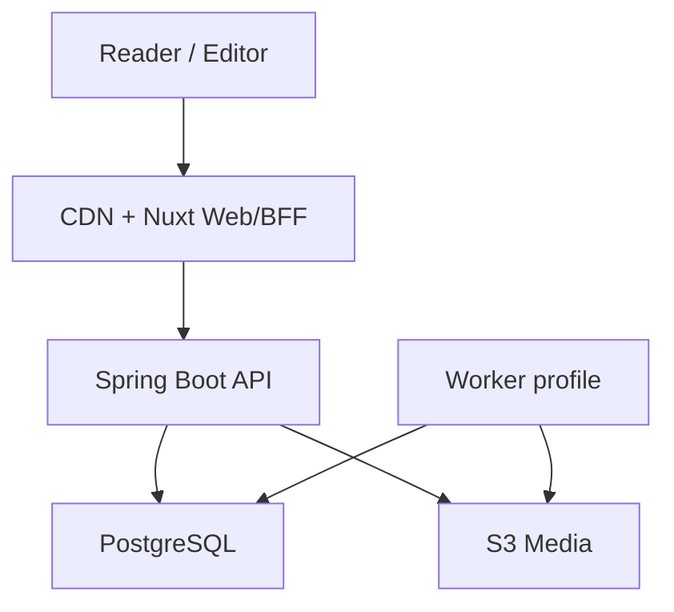
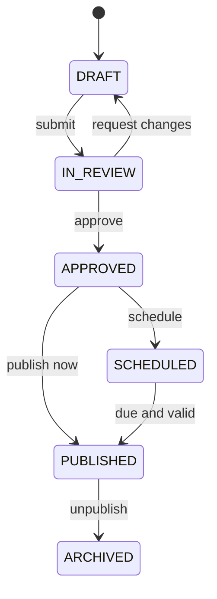

# Implementation Plan: 台灣籃球雜誌電子書

**Branch**: `001-taiwan-basketball-magazine-ebook` | **Date**: 2026-08-06 | **Spec**: `specs/001-taiwan-basketball-magazine-ebook/spec.md`  
**Input**: Feature specification from `/specs/001-taiwan-basketball-magazine-ebook/spec.md`

## Summary

以「公開閱讀優先、出版流程可追溯、媒體權利先於發布」為核心，建立一個 Mobile-first 數位雜誌平台。公開期刊與文章由 Nuxt SSR 輸出，Spring Boot modular monolith 負責內容版本、審稿、發布、媒體權利、搜尋、收藏與稽核；PostgreSQL 保存交易資料與結構化內容文件，S3 相容儲存保存原始媒體與公開衍生檔。

MVP 採三個可獨立驗收的 P1 slice：

1. 匿名讀者瀏覽期刊並開始閱讀。
2. 讀者完成長篇文章閱讀與期刊內導覽。
3. 編輯團隊完成草稿到發布／下架的受控工作流。

搜尋、帳號收藏／續讀列為 P2；離線期刊列為 P3。付款、付費牆、留言、即時比分與原生 App 不進入此 feature。

## Technical Context

| Item | Decision |
| --- | --- |
| Frontend language/runtime | TypeScript strict mode；Node.js 24 LTS |
| Frontend framework | Nuxt 4.5.x、Vue 3、Vite 8；公開頁 SSR，後台採 client-enhanced SSR |
| Backend language/runtime | Java 21 LTS；Spring Boot 4.1.x |
| Architecture | Monorepo；Nuxt web + Spring Boot modular monolith；同一 API artifact 可用 `api`／`worker` profile 執行 |
| API | REST + OpenAPI 3.1；錯誤使用 RFC 9457 Problem Details；generated TypeScript client |
| Storage | PostgreSQL 18；S3-compatible object storage；CDN |
| Content model | Versioned block document（JSON Schema + JSONB），禁止任意 HTML 成為 canonical source |
| Authentication | OIDC Authorization Code + PKCE；Nuxt BFF session 使用 Secure/HttpOnly/SameSite cookie；Spring Security 驗證 JWT |
| Search | PostgreSQL `pg_trgm` + normalized search document；以 curated zh-TW query set 驗證，達取消條件才導入專用搜尋服務 |
| Background work | PostgreSQL transactional outbox + worker profile；資料庫鎖確保排程冪等，MVP 不引入 message broker |
| Frontend testing | Vitest、Vue Test Utils、Playwright、axe-core、Lighthouse CI |
| Backend testing | JUnit 5、Spring Boot Test、Testcontainers、ArchUnit、REST Assured |
| Contract testing | OpenAPI lint/diff、generated client compile、API integration tests |
| Performance testing | k6 public-read scenario + production Core Web Vitals RUM |
| Deployment target | Container platform + managed PostgreSQL + S3-compatible storage + CDN；供應商保持可替換 |
| Observability | OpenTelemetry、Micrometer、structured JSON logs、request/trace ID、SLO alerts |
| Scope | 首年 <10,000 篇文章；每月 ≤4 期；每期 ≤50 篇；單一品牌、單一編輯團隊 |

### Version Baseline Verification

版本基準於 2026-08-06 依官方來源確認：Nuxt 4.5 已發布且使用 Vite 8；Spring Boot 官方穩定頁顯示 4.1.0；Node.js 24 為 LTS；PostgreSQL 18 為 current、19 仍為 beta。實作時鎖定相容 patch 版本，不追逐 RC／beta。

## Constitution Check

目前工作區沒有正式 `constitution.md`。以下為本 feature 的 provisional gates；`tasks.md` 的第一個 blocking task 必須把它們落為專案 constitution，核准後才能進入功能實作。

| Gate | Rule | Status |
| --- | --- | --- |
| Spec traceability | 每個 API、資料表、畫面與測試可追溯到 FR／User Story；不得由 task 私自擴大 MVP | PASS |
| Contract first | OpenAPI 與 Content JSON Schema 先於前後端功能；generated client 不手改 | PASS |
| Immutable publication | 已發布內容不可原地覆寫；發布／撤回原子化且具 audit trail | PASS |
| Rights before reach | 缺少有效授權與署名的媒體不得送審或發布；撤回高於快取可用性 | PASS |
| Testable slices | 每個 P1 User Story 先建立失敗的 contract／integration／E2E 測試再實作 | PASS |
| Accessible and fast | WCAG 2.2 AA 與 Core Web Vitals 是 release gate，不是發布後 backlog | PASS |
| Least privilege | OIDC、RBAC、BFF session、短效上傳 URL；草稿與原始媒體預設不公開 | PASS |
| Operational recovery | 冪等 worker、可觀測性、RPO 24h／RTO 4h 與還原演練必須在 GA 前驗證 | PASS |
| Simplicity budget | MVP 不引入 message broker、專用搜尋叢集、microservices 或付費系統 | PASS |

**Gate result**: `PASS WITH BLOCKING ACTION`。T001 constitution 與 T002 ADR approval 完成後，才可開始 T009 之後的 implementation tasks。

## Architecture



### Runtime Responsibilities

#### Nuxt Web/BFF

- SSR 公開首頁、期刊、文章、搜尋與 SEO metadata。
- 渲染經 JSON Schema 驗證的內容 block；不使用 `v-html` 渲染 canonical content。
- 提供後台 UI、OIDC callback 與 Secure/HttpOnly session。
- 對 Spring API 使用 generated client；不得自行拼接隱性 API contract。
- 提供匿名閱讀進度的 local adapter，登入後透過明確合併流程同步。
- P3 才啟用 offline issue manifest 與 service worker content cache。

#### Spring Boot API

- 擁有 Publication、Content、Media、Taxonomy、Identity、Reader Library、Search、Audit 模組。
- 驗證狀態轉換、角色權限、媒體權利、樂觀鎖與發布交易。
- 建立不可變 ArticleRevision 與公開 revision pointer。
- 產生簽章上傳意圖、確認 checksum／MIME／尺寸與媒體處理狀態。
- 只公開可發布投影，不讓 public endpoint 查詢 draft entity graph。
- 將索引、媒體處理、排程發布、撤回與 CDN invalidation 事件寫入 outbox。

#### Worker Profile

- 與 API 共用 artifact 與 domain code，但以不同 process profile 執行。
- 以 claim + lease + idempotency key 消費 outbox，不依賴單機 scheduler 正確性。
- 執行媒體衍生圖、metadata 清除、排程發布、搜尋投影更新、撤回與 cache purge。
- 工作失敗採 bounded retry + dead-letter state；超過門檻告警，不無限重試。

### Module Boundaries

| Module | Owns | May depend on |
| --- | --- | --- |
| `identity` | OIDC subject mapping、roles、authorization policy | audit |
| `publication` | issues、sections、issue ordering、state transitions、publication jobs | content、media、identity、audit、outbox |
| `content` | articles、revisions、content validation、contributors | taxonomy、media、audit |
| `media` | assets、variants、rights records、upload lifecycle、revocation impact | identity、audit、outbox |
| `taxonomy` | terms、aliases、historical labels、relationships | audit |
| `search` | public search projection、query normalization、ranking | publication events、taxonomy |
| `readerlibrary` | bookmarks、reading progress、account erasure | identity、publication |
| `analytics` | consent-aware minimal product events and retention controls | identity、publication |
| `audit` | append-only security and publication events | none |
| `outbox` | durable domain event delivery and worker lease | none |

模組只能透過 application service／domain event 互動；禁止跨模組 repository 直接 join 後修改他模組 aggregate。讀取型投影可透過明確 SQL view 或 read repository 組合，但不得繞過公開狀態規則。

## Critical Data Design

### Aggregate and Revision Strategy

- `article` 是穩定 identity，包含 `draft_revision_id`、`published_revision_id` 與 `version`。
- `article_revision` 一旦建立即不可變；編輯儲存會建立新 revision 或更新尚未提交審稿的 working draft，送審後凍結。
- `publication_issue` 保存 `published_version`；`issue_publication_snapshot` 固定當次公開目錄與文章 revision IDs。
- 公開 endpoint 只讀 snapshot／published pointer，避免排程發布時讀到半完成狀態。
- 所有 aggregate 使用 UUIDv7／時間排序 UUID，外部 API 不暴露自增序號。
- 所有寫入帶 `version`／`If-Match`；衝突回傳 `409` 與目前版本，不採 last-write-wins。

### Tables

| Table | Purpose | Important constraints |
| --- | --- | --- |
| `publication_issue` | 期刊 identity 與 workflow | unique `slug`; state check; optimistic `version` |
| `issue_section` | 目錄章節與排序 | unique `(issue_id, position)` |
| `article` | 文章 identity 與 revision pointers | unique `slug`; published pointer FK |
| `article_revision` | 不可變內容版本 | unique `(article_id, revision_no)`; JSON schema version |
| `issue_article` | 期刊目錄關聯 | unique `(issue_id, article_id)` and `(section_id, position)` |
| `issue_publication_snapshot` | 原子公開快照 | immutable payload + checksum + published_at |
| `contributor` / `article_contributor` | 作者與角色 | stable public slug; ordered credits |
| `media_asset` | 媒體 identity、storage key、processing state | checksum; MIME allowlist; no public original key |
| `media_variant` | 公開衍生尺寸 | unique `(asset_id, variant)` |
| `rights_record` | 署名與授權狀態 | channel/date validation at review and publish |
| `taxonomy_term` / `taxonomy_alias` | 非硬編碼分類與歷史名稱 | type + normalized name + validity range |
| `article_taxonomy` | 文章分類關聯 | unique `(article_id, term_id)` |
| `reader_profile` | 最小 OIDC subject mapping | unique `(issuer, subject)` |
| `bookmark` | 收藏 | unique `(reader_id, article_id)` |
| `reading_progress` | revision-aware 續讀 | unique `(reader_id, article_id)`; bounded percent |
| `search_document` | 已發布搜尋投影 | no draft content; versioned source checksum |
| `outbox_event` | durable async work | unique idempotency key; lease and retry fields |
| `audit_event` | append-only audit trail | no update/delete app permission |

### Content Document Contract

Canonical content 使用 `content-document.schema.json`，最外層至少包含：

```json
{
  "schemaVersion": 1,
  "documentId": "uuid",
  "blocks": [
    {
      "id": "uuid",
      "type": "paragraph",
      "version": 1,
      "payload": {}
    }
  ]
}
```

規則：

- 每一 block type 都有獨立 schema、Nuxt renderer、editor extension 與 fixtures。
- API 在接受寫入時做 JSON Schema 驗證、URL protocol allowlist、文字與陣列長度限制。
- 純文字搜尋投影由可信 server extractor 產生，不接受 client 直接提供。
- media block 只保存 `assetId` 與展示選項，不保存任意外部 HTML。
- iframe 僅允許明確 provider 與 canonical embed URL；無法識別時降級為外部連結。
- schema migration 必須是可重跑的純轉換，保留原 revision 與 migration evidence。

## Publication Lifecycle



### Publication Transaction

1. 驗證 actor role、aggregate version、issue completeness、article approval 與 media rights。
2. 鎖定 issue aggregate，建立 publication snapshot 與 checksum。
3. 原子切換 issue/article public pointers，寫 audit event 與 outbox events。
4. commit 後 worker 更新 search projection、sitemap signal 與 CDN purge。
5. public cache 最長 60 秒；撤回事件優先 purge，失敗即告警並持續 bounded retry。

相同 `Idempotency-Key` 重試只能取得同一 operation result。排程到期不代表一定發布；任何權利或核准條件在執行當下失效，job 轉 `BLOCKED` 並列出原因。

## API Contract Surface

所有 endpoint 以 `/api/v1` 為前綴，公開與受保護資源分離。以下是最小 contract，完整 OpenAPI 由 T006 建立。

### Public

| Method | Path | Result |
| --- | --- | --- |
| `GET` | `/public/issues` | cursor-paginated published issue summaries |
| `GET` | `/public/issues/{issueSlug}` | issue metadata + visible ordered TOC |
| `GET` | `/public/articles/{articleSlug}` | published article projection + issue navigation |
| `GET` | `/public/search` | query + filters + cursor-paginated results |
| `GET` | `/public/taxonomy/{type}` | active public filter terms |
| `GET` | `/public/withdrawals` | signed/versioned offline withdrawal manifest |

### Reader

| Method | Path | Result |
| --- | --- | --- |
| `GET` | `/me/bookmarks` | current reader bookmarks |
| `PUT` / `DELETE` | `/me/bookmarks/{articleId}` | idempotent bookmark state |
| `GET` | `/me/progress` | current reader progress list |
| `PUT` | `/me/progress/{articleId}` | revision-aware progress upsert |
| `POST` | `/me/progress:merge` | explicit local/server merge preview + apply |
| `DELETE` | `/me` | verified account deletion workflow |

### Editorial

| Method | Path | Result |
| --- | --- | --- |
| `POST/GET/PATCH` | `/editor/issues` | issue draft CRUD with `If-Match` |
| `POST/GET/PATCH` | `/editor/articles` | article identity and revision CRUD |
| `POST` | `/editor/articles/{id}:submit` | rights/content validation + review transition |
| `POST` | `/publisher/articles/{id}:approve` | approve frozen revision |
| `POST` | `/publisher/issues/{id}:publish` | immediate idempotent publish |
| `POST` | `/publisher/issues/{id}:schedule` | schedule using explicit timezone input |
| `POST` | `/publisher/articles/{id}:withdraw` | emergency withdrawal with reason |
| `POST` | `/editor/media/uploads` | signed upload intent |
| `POST` | `/editor/media/{id}:complete` | checksum/MIME confirmation and processing enqueue |
| `POST` | `/publisher/media/{id}:revoke` | rights revocation + impact report |
| `POST/GET/PATCH` | `/editor/taxonomy` | taxonomy management |

### Error Contract

- `application/problem+json` with `type`, `title`, `status`, `detail`, `instance`, `requestId`, `code`.
- Validation failures add stable field errors;不得把 stack trace、SQL 或草稿內容放進 response。
- `409` 用於 version conflict、state conflict、slug conflict。
- `422` 用於內容／rights gate 不通過，回傳 stable blocking codes。
- `429` 包含 retry hint；登入與上傳採更嚴格的 separate buckets。

## Frontend Information Architecture

### Public routes

- `/`：最新一期 hero、期刊列表、精選文章與主題入口。
- `/issues`：過往期刊列表。
- `/issues/[issueSlug]`：期刊封面、簡介與分章目錄。
- `/articles/[articleSlug]`：文章 reader、進度、期刊導覽與相關內容。
- `/search`：關鍵字、分類 filters、結果與空狀態。
- `/library`：登入後收藏與續讀。

### Editorial routes

- `/studio/issues`、`/studio/issues/[id]`
- `/studio/articles`、`/studio/articles/[id]`
- `/studio/review`
- `/studio/media`、`/studio/taxonomy`
- `/studio/audit`

### UI architecture

- `features/*` 擁有 use case、view model、components 與 tests；`components/ui` 只放無領域語意元件。
- 公開頁使用 server data fetching；同一 request 不重複由多個 component 拉資料。
- Pinia 僅保存跨 route 的 ephemeral client state；server state 由 Nuxt data utilities 管理。
- Design tokens 集中在 CSS custom properties；文章 typography 與 Studio dense UI 使用不同 token layer。
- 圖片固定 width/height 或 aspect-ratio，使用 `srcset`、lazy loading 與 dominant placeholder 控制 CLS。
- 閱讀進度以 block anchor 為主、百分比為輔，避免字級或 viewport 改變後定位失真。

## Security and Privacy Plan

### Threat priorities

1. 草稿、歷史修訂、媒體原檔或撤回內容被越權讀取。
2. 編輯器內容造成 stored XSS／惡意 embed。
3. OIDC token／session 外洩、CSRF 或角色提升。
4. 簽章上傳被拿來放置任意檔案、超大檔或惡意 payload。
5. 發布／下架重送、競態或 worker 重試造成不一致。
6. 閱讀分析過度收集個資。

### Controls

- Public repository 與 editorial repository 分離；public query 不接受 `includeDraft` 參數。
- Nuxt BFF 使用 HttpOnly cookie、session rotation、CSRF token 與 strict redirect URI allowlist。
- Spring Security method authorization；角色 mapping 只信任設定好的 issuer/audience/claim。
- Content schema validation + sanitizer + CSP；禁止 inline script 與未知 iframe origin。
- 上傳 URL 短效、綁定 key／size／MIME；完成後 server 重新檢查 magic bytes 與 checksum。
- 原始媒體 bucket 私有；公開只用不可猜測且可撤回的 variant URL。
- 寫入 API 使用 idempotency key、transaction、optimistic lock 與 append-only audit。
- 日誌不記錄 access token、完整文章正文、email、signed URL 或原始 media key。
- Analytics 採最小事件與 consent gate；讀者可閱讀時不強迫接受非必要追蹤。
- CI 執行 dependency、secret、SAST 與 container scan；critical finding 阻擋 release。

## Search Plan

MVP 不導入 Elasticsearch／OpenSearch。`search_document` 僅保存已發布投影：

- 正規化全形／半形、大小寫、空白與可設定同義詞。
- title、dek、contributors、taxonomy labels 權重高於 body excerpt。
- 使用 `pg_trgm` GIN indexes 支援中英混合與錯字容忍；英文 token 可另外使用 `tsvector`。
- 以固定的 zh-TW 查詢資料集測試球員、球隊、聯盟別名與同名情境。
- cursor 由 `(score, published_at, article_id)` 組成，避免 offset 深頁退化。

**Escalation trigger**: 任一條件連續兩週成立才研究專用搜尋服務：資料量 >50,000 篇、p95 >500 ms、搜尋 index >資料庫 30%、curated relevance NDCG@10 <0.75，或需要跨字詞語意搜尋。禁止只因「未來可能變大」提前加叢集。

## Media Pipeline

1. Client 要求 upload intent，API 建立 `PENDING` asset 與限定條件的 signed URL。
2. Client 直傳 private original bucket，回報 checksum、size、MIME。
3. Worker 讀 magic bytes、掃描檔案、移除 EXIF、產生 AVIF/WebP/JPEG variants 與 blur placeholder。
4. API 將 asset 轉 `READY`；rights record 不完整仍不可用於送審。
5. 發布 snapshot 只引用 `READY` 且 rights `VALID` 的 asset variants。
6. 撤回時產生 impact report，更新 public pointers、search、CDN 與 offline withdrawal manifest。

MVP 圖片上限與影片策略需在 implementation ADR 定稿；預設圖片上限 20 MiB、影片只允許經核准 provider embed，不自行託管影片。

## Caching and Consistency

- 公開 issue/article API 支援 `ETag` 與 `Cache-Control`；ETag 由 published snapshot checksum 產生。
- CDN 與 Nuxt server cache 的 positive TTL ≤60 秒；404／withdrawn negative cache ≤10 秒。
- 發布與撤回事件帶 surrogate keys，worker 對 issue、article、search、sitemap 路徑失效。
- 緊急撤回若 purge provider 失敗，public origin 仍以 active pointer 拒絕內容；不得因 CDN 可用性繼續送出撤回正文。
- Studio 與 preview response 一律 `private, no-store`。

## Offline Plan (P3)

- PWA app shell 與離線 issue content 分開管理 cache。
- 下載前由 API 回傳 signed manifest、revision IDs、asset variants、總 bytes 與 rights expiry。
- 使用 temporary cache 完成 checksum 驗證後才原子切換為 installed。
- 線上時定期抓取 versioned withdrawal manifest；撤回優先刪除本機內容。
- 不承諾永久離線或 DRM；若法務要求無法在 web platform 合理執行的強撤回保證，取消 P3 offline 而非假裝安全。

## Observability and SLOs

### Signals

- HTTP request rate/error/duration by route template，不標記 article title 或 user ID。
- Publish job latency、blocked reason、retry count、dead-letter count。
- Media processing latency、failure reason、bytes 與 variant count。
- Search latency、zero-result rate、query length bucket；原始 query 是否保存由 privacy review 決定。
- Cache hit、purge latency、stale version observations。
- Web Vitals、reader JS error、Studio save conflict、upload failure。

### Initial SLOs

| Journey | SLI | Target |
| --- | --- | --- |
| Public read | successful issue/article responses | 99.9% monthly |
| Public API | p95 origin latency | ≤300 ms at baseline load |
| Publication | approved publish completed or explicitly blocked | 99% within 60 s |
| Withdrawal | origin denies withdrawn content | 99% within 30 s; 100% within 60 s |
| Media | valid image reaches READY | 99% within 5 min |
| Search freshness | public change visible in search | 99% within 60 s |

## Testing Strategy

### Test pyramid and gates

- **Schema tests**: every content block has valid/invalid fixtures against the same JSON Schema revision.
- **Unit tests**: state transitions, rights decisions, reading progress merge, search normalization, renderer view models.
- **Architecture tests**: enforce module boundaries and forbid cross-module repository access.
- **Contract tests**: OpenAPI examples, status/error codes, generated client compile, backward compatibility diff.
- **Integration tests**: PostgreSQL/S3 emulator/OIDC stubs via Testcontainers; publication transaction and worker idempotency.
- **Component tests**: block renderers, TOC, reader navigation, editor validation, upload states.
- **E2E tests**: each P1 acceptance scenario; P2/P3 are added with their slice.
- **Accessibility**: automated axe for core routes plus manual keyboard, VoiceOver/TalkBack/NVDA smoke test matrix.
- **Performance**: Lighthouse CI budgets, k6 public reads, large 20-article issue, content document limit tests.
- **Recovery**: restore latest backup into isolated environment and verify row counts, checksums and sampled public projections.

### Release gate

不得以「測試稍後補」發布 P1。Beta 需通過：

- P1 requirement traceability complete。
- contract/unit/integration/E2E green。
- zero critical/high exploitable security findings。
- WCAG automated zero serious/critical，人工 smoke pass。
- Lighthouse budgets pass on representative mobile profile。
- publish/withdraw retry and idempotency evidence captured。
- backup restore drill passed。

## Delivery and Rollback

### Environments

- `local`: Docker Compose 啟動 PostgreSQL、S3 emulator、OIDC stub、API、worker、web。
- `preview`: 每個 PR 使用隔離 DB schema／bucket prefix，載入去識別 seed content。
- `staging`: 與 production 相同拓撲，用於內容驗收、load、restore 與排程時間測試。
- `production`: managed DB/object storage/CDN，最小權限 service identities。

### Deployment order

1. 先部署 backward-compatible DB migration。
2. 部署 API／worker，保持舊 contract 可用。
3. 部署 Nuxt web，啟用新 client。
4. smoke test public、editor、publish、withdraw。
5. 以 feature flag 開啟 editor slice，再開 public routes。

### Rollback rules

- App rollback 不自動回滾已執行 migration；schema changes 採 expand → migrate → contract。
- 發布內容 rollback 使用既有已核准 snapshot 重新指向，不覆寫 revision。
- worker 新 job type 先支援舊 payload 版本；無法解析時 dead-letter，不猜測。
- 若公開讀取錯誤率 >2% 持續 5 分鐘、權限洩漏或撤回失效，立即關閉受影響 route／feature flag 並回退上一 image。

## Project Structure

### Documentation (this feature)

```text
specs/001-taiwan-basketball-magazine-ebook/
├── spec.md
├── plan.md
└── tasks.md
```

### Source Code (repository root)

```text
.
├── apps/
│   ├── web/
│   │   ├── app/
│   │   │   ├── assets/
│   │   │   ├── components/
│   │   │   │   ├── content-blocks/
│   │   │   │   └── ui/
│   │   │   ├── features/
│   │   │   │   ├── issues/
│   │   │   │   ├── reader/
│   │   │   │   ├── search/
│   │   │   │   ├── library/
│   │   │   │   └── studio/
│   │   │   ├── pages/
│   │   │   └── stores/
│   │   ├── server/
│   │   │   ├── api/
│   │   │   ├── middleware/
│   │   │   └── services/
│   │   └── tests/
│   │       ├── component/
│   │       ├── e2e/
│   │       └── fixtures/
│   └── api/
│       ├── src/main/java/tw/basketball/magazine/
│       │   ├── identity/
│       │   ├── publication/
│       │   ├── content/
│       │   ├── media/
│       │   ├── taxonomy/
│       │   ├── search/
│       │   ├── readerlibrary/
│       │   ├── analytics/
│       │   ├── audit/
│       │   ├── outbox/
│       │   └── shared/
│       ├── src/main/resources/db/migration/
│       └── src/test/
├── packages/
│   ├── api-client/
│   ├── content-schema/
│   ├── eslint-config/
│   └── tsconfig/
├── contracts/
│   ├── openapi.yaml
│   └── content-document.schema.json
├── infra/
│   ├── compose/
│   ├── docker/
│   ├── deployment/
│   └── observability/
├── scripts/
└── .github/workflows/
```

**Structure Decision**: 採 monorepo + 兩個應用程式，保留前後端 API contract 與部署邊界；後端維持 modular monolith，不拆 microservices。`packages/api-client` 完全由 `contracts/openapi.yaml` 生成；`packages/content-schema` 保存 schema、fixtures 與 TS types，Java 端直接讀同一 schema 做 runtime validation。

## Implementation Phases

| Phase | Outcome | Exit evidence |
| --- | --- | --- |
| 0. Governance & contracts | constitution、ADRs、OpenAPI、content schema、repo baseline | schema lint + contract compile |
| 1. Foundation | DB、OIDC/RBAC、media pipeline、outbox、observability | Testcontainers integration green |
| 2. P1 Reader | issue discovery + article reader | US1/US2 E2E + CWV/a11y budgets |
| 3. P1 Studio | editorial workflow + publication/withdrawal | US3 E2E + audit/idempotency evidence |
| 4. P2 Discovery & library | search + taxonomy + bookmark/progress | US4/US5 independent tests |
| 5. P3 Offline | issue download + withdrawal | US6 offline matrix |
| 6. GA hardening | security、load、recovery、runbooks | release gate complete |

### Indicative Effort

以 1 名全端工程師、0.5 名前端／設計支援、0.25 名編輯 domain owner 計算：P1 beta 約 10–12 週；P2 約 3–4 週；P3 約 2–3 週。這是容量規劃假設，不是交付承諾。若只有單一工程師，先停在 P1 beta 進行真實內容驗證，不同時啟動 P2/P3。

## Risks, Trade-offs and Cancellation Conditions

| Risk | Impact | Mitigation | Cancellation / downgrade condition |
| --- | --- | --- | --- |
| 自建編輯器範圍膨脹 | 延遲 P1、renderer 不一致 | MVP block types ≤10；每種 block 都需 schema/renderer/test | 首期需求超過 10 種 block 時，改採已驗證 headless editor adapter 或刪版型，不無限擴充 |
| 媒體授權資料不完整 | 法律與品牌風險 | rights gate、署名必填、撤回 impact report | 無法由內容 owner 提供使用依據的媒體，不發布、不以技術手段繞過 |
| 雙 runtime 維運成本 | build/deploy/debug 複雜 | monorepo、單一 OpenAPI、shared CI、modular monolith | 團隊無 Java 維運能力且 P1 尚未開始時，重新 ADR 評估 Nuxt full-stack；開始後不半途雙寫 |
| 中文搜尋品質不足 | 找不到歷史內容 | curated query set、aliases、pg_trgm、可觀測 zero-result | 達 search escalation trigger 後獨立規劃搜尋服務，不塞進 P1 |
| CDN 與下架不一致 | 撤回內容仍被讀到 | short TTL、surrogate purge、origin active pointer | provider 無法在 60 秒內可靠 purge，降低 cache TTL 或暫停 CDN article cache |
| Offline 無法保證撤回 | 授權／法務風險 | withdrawal manifest、online revalidation、清楚限制 | 若必須保證永久離線裝置立即撤回，取消 web offline feature |
| 大圖造成速度與成本問題 | CWV 失敗、流量費用 | direct upload、variants、AVIF/WebP、budget | SC-002 未達標即減少首屏媒體與動態版型，不能用提高 budget 解決 |
| 內容 migration 未知 | 上線前大量人工成本 | MVP 假設新內容；另立 migration spec | 若上線必須先匯入 >500 篇舊文，先暫停 P2/P3，建立 migration feature |

## Complexity Tracking

| Violation / Added Complexity | Why Needed | Simpler Alternative Rejected Because |
| --- | --- | --- |
| Nuxt + Spring Boot two-app topology | SSR/SEO 與 Vue DX 交給 Nuxt；發布交易、RBAC、worker 與 audit 由 Java domain layer 保護 | 單一 SPA 會犧牲 SEO/無 JS 閱讀；Nuxt-only 雖更少 deployable，但會把既有 Java 能力與嚴格出版交易壓到同一 runtime，需另 ADR 才可改 |
| Immutable revisions + publication snapshots | 防止靜默改稿、支援稽核與安全 rollback | 原地更新文章雖簡單，但不符合 FR-012/020 與撤回／修訂證據需求 |
| Transactional outbox | 發布 commit 與搜尋/CDN/media 副作用不能因 process crash 遺失 | 同交易直接呼叫外部服務會造成長交易與不一致；message broker 對 MVP 又過重 |
| Structured content schema | 支援可驗證的雜誌 block、SSR、安全與 migration | 任意 HTML 開發快，但 XSS、跨端 rendering 與版本演進成本不可控 |

## Decisions Required Before Implementation

T001–T005 應在兩個工作日內定稿，否則停止功能實作：

1. 核准 provisional constitution 與 release gates。
2. 選定 OIDC provider、email provider 與 production hosting；保留 contract，不把 provider SDK 滲入 domain。
3. 定義首期實際內容樣本、最多 10 種 block、圖片上限與允許 video providers。
4. 確認品牌名稱、合法字體／媒體素材與至少一位 `PUBLISHER` content owner。
5. 確認 P1 全部免費；若不是，退回 spec 先補 entitlement/commerce，而不是直接開始開發。

## Source Baseline

- GitHub Spec Kit workflow and templates: https://github.com/github/spec-kit
- Nuxt 4.5 official release: https://nuxt.com/blog/v4-5
- Node.js release status: https://nodejs.org/en/about/previous-releases
- Spring Boot official project baseline: https://spring.io/projects/spring-boot/
- PostgreSQL current documentation: https://www.postgresql.org/docs/
